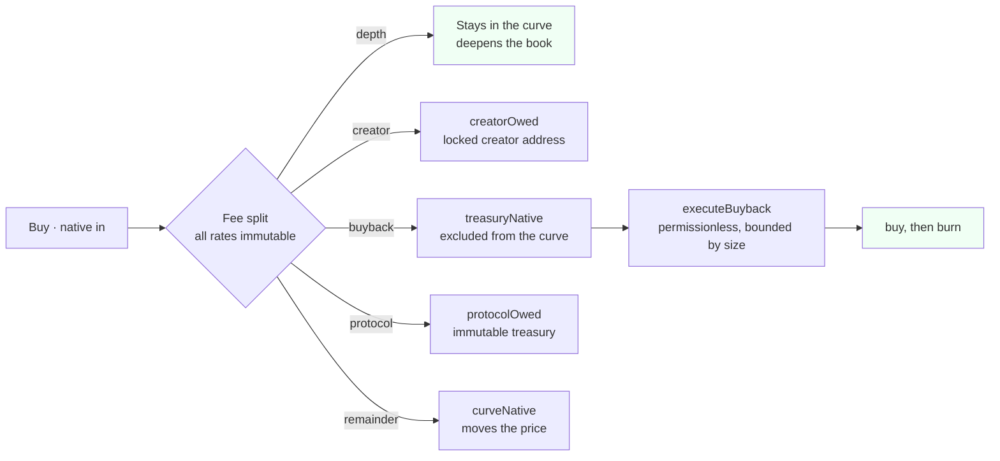
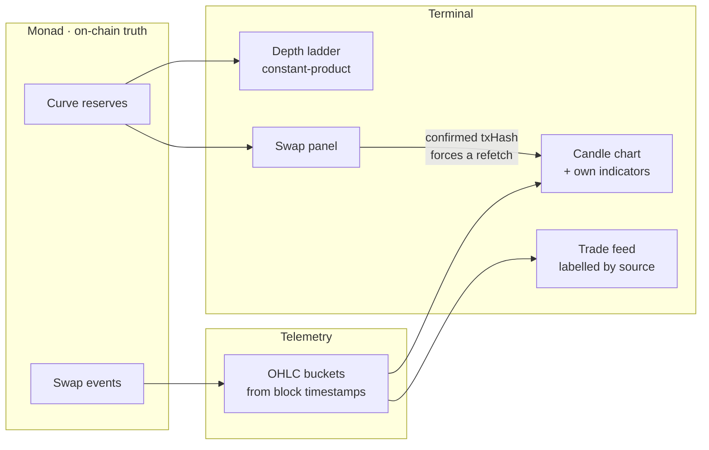
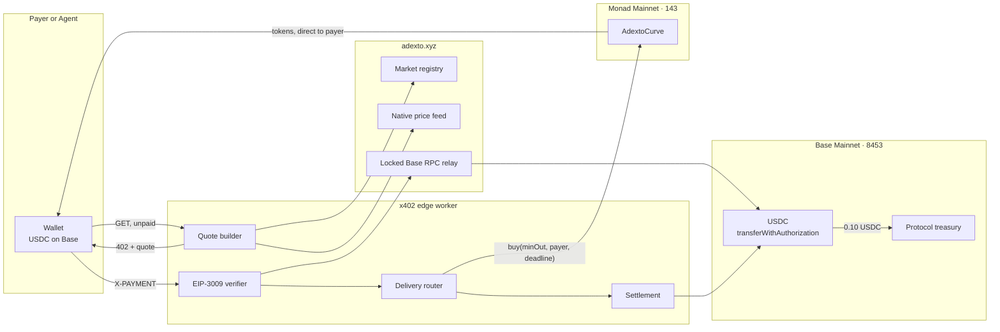
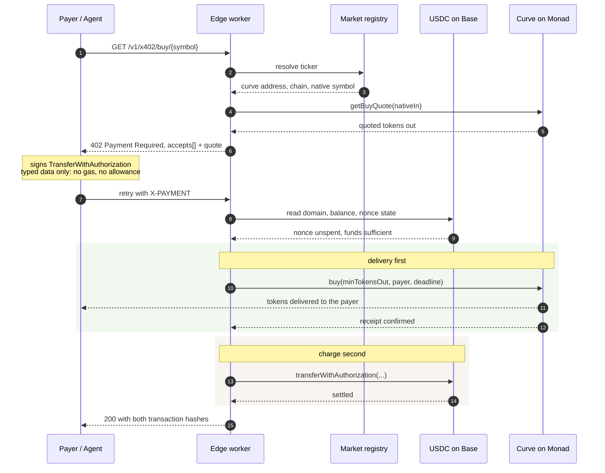
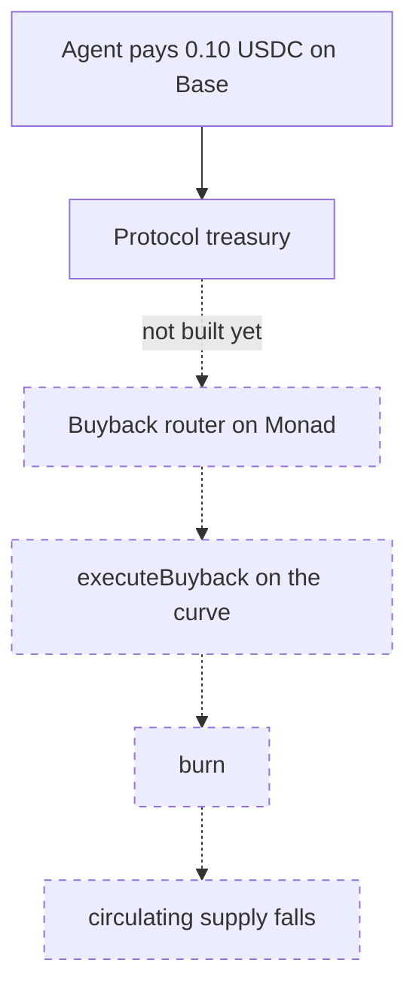
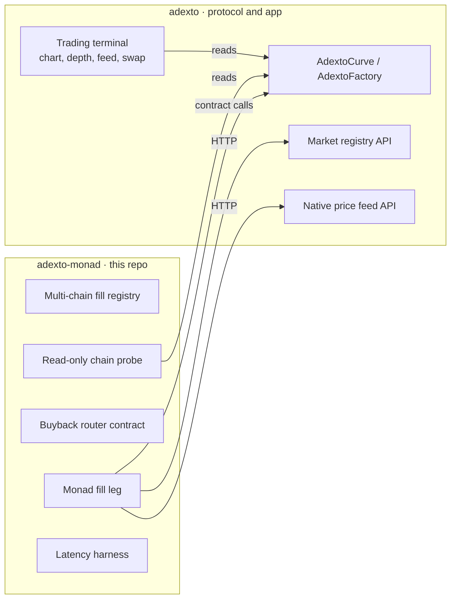

# adexto-monad

**A bonding-curve market that opens on Monad with no liquidity deposit, is tradable from
the first block, and can be bought into from another chain.**


Launching a token normally means funding a pool before anyone can trade it. That deposit
is the real barrier, not the gas: it has to be paid per chain, it is the thing a creator
can pull, and it is why most launch venues end up custodial in practice.

This one opens a market against a **virtual reserve**. There is no deposit, 100% of supply
enters the curve at genesis, the curve *is* the permanent venue — no graduation step, no
external pool, no owner, and no withdrawal function anywhere on the path. Every fee rate is
`immutable`. The creator earns from swap flow instead of holding an allocation.

On top of that sits a trading terminal built for markets that are minutes old, and an
HTTP on-ramp that lets a buyer on another chain take a position without bridging.

> **Where each piece lives.** This repository holds the Monad-specific engineering: the
> multi-chain delivery registry, the Monad fill leg, the buyback router, and a read-only
> chain probe. The curve, factory, registry API and the trading terminal live in
> [`0xcuy/adexto`](https://github.com/0xcuy/adexto) and are consumed over public APIs.
> Duplicating them here would create two sources of truth for one deployed contract.
>
> **Status, stated plainly.** The factory is live on Monad and its launch path is verified
> by simulation, but **no market exists on Monad yet** and the fill leg still targets 0G.
> Those two things are the work in progress. The [status matrix](#status) separates what
> runs from what does not.

---

## Contents

- [The market structure](#the-market-structure)
- [The trading surface](#the-trading-surface)
- [Why Monad, specifically](#why-monad-specifically)
- [Reaching a Monad market from another chain](#reaching-a-monad-market-from-another-chain)
- [Why delivery runs before the charge](#why-delivery-runs-before-the-charge)
- [The value loop](#the-value-loop)
- [Status](#status)
- [Verified on chain](#verified-on-chain)
- [Contract call traps](#contract-call-traps)
- [Quickstart](#quickstart)
- [Repository boundary](#repository-boundary)
- [Metropolis submission](#metropolis-submission)

---

## The market structure

The curve is a constant-product AMM whose native side opens at a number in storage rather
than a balance in the contract:

```
nativeReserve = virtualNative + curveNative        curveNative starts at 0
k             = nativeReserve * tokenReserve
```

Because 100% of supply enters the curve at genesis, `virtualNative` **is** the opening
market cap — not an approximation of it. Solvency is proven by construction rather than by
policy: `k / (tokenReserve - sold) >= virtualNative` holds for every reachable state, so
the curve can always pay out what it owes.

Four fee legs, and every rate is `immutable` with no setter and no admin:



What each leg buys you, and why the split is inside the total rather than added on top:

| Leg | Accrues to | Who can move it |
| --- | --- | --- |
| depth | the curve itself | nobody — it is reserve |
| creator | `creatorOwed` | the creator address locked at launch |
| buyback | `treasuryNative`, excluded from reserve | **anyone**, via `executeBuyback` |
| protocol | `protocolOwed` | claimable only to an `immutable protocolTreasury` |

Three properties follow, and they are the reason this is a market primitive rather than a
launch button:

**Native leaves only two ways.** A seller's payout, or a fee claim. There is no
`withdraw`, no `sweep`, no `rescue`, and no owner to call one. That is what makes the curve
a venue instead of a custody arrangement.

**Buyback is permissionless.** `executeBuyback` is bounded by size, not by identity, so the
burn path does not depend on the team being alive or willing.

**Nothing about the economics can be changed after launch.** Rates are `immutable` at
construction. A governor contract is deployed on all four chains and controls exactly
nothing, because there is no setter for it to call.

---

## The trading surface

A market that is four minutes old cannot be charted by an embed. A TradingView or
GeckoTerminal frame resolves a symbol against that provider's database, and a token
launched from this factory minutes ago is in neither — so the embed renders empty. The
terminal therefore computes its own indicators from the same candles it draws.



**Sub-minute candles, because a newborn curve trades per second.** Timeframes run
`1s · 5s · 15s · 1m · 5m · 15m · 1h · 4h · 1d · 1y`. On a one-minute bucket, a buy then a
sell then a buy inside the same minute collapse into a single candle whose close is
whichever happened last — which describes the minute but hides the market.

**Indicators are computed, not embedded.** `lightweight-charts` is TradingView's renderer
but ships no indicators, so overlays and panes are derived locally: EMA 9, EMA 21, SMA 50,
Bollinger 20,2 and VWAP as overlays; RSI 14 and MACD 12,26,9 as panes.

**An under-warmed indicator is not drawn.** RSI(14) needs 15 bars and MACD needs 34. Below
that the series is a gap and the footer states how many bars are still missing. A
half-warmed average rendered as a confident line is the same class of lie as an invented
candle, and this is where most young-market charts quietly break.

**Depth is the real clearing price.** The ladder is computed with the same constant-product
formula the contract executes, so a level's price is what a trade of that size would
actually clear at — not `spot × (1 ± i × 0.002)` with a flat size per level, which is what
it used to be. When no executable pool exists it says so instead of inventing depth.

**Fills are labelled by source.** Genesis seeding is never presented as live market
activity, and `AUTO_BUYBACK` is distinguished from a trader's `BUY`. Each row links to the
explorer for its own `chainId` rather than guessing from a chain-name substring.

**A confirmed trade updates the chart immediately.** Polling runs every 15 seconds; without
an override, someone who just sold would watch a chart with no sign of their fill. The
refetch is keyed on the transaction hash and fires after the receipt is parsed, so the swap
log is already in a block when the data is re-read.

**Market cap has no footnote.** With 100% of supply in the curve, no locked portion and no
creator allocation, MCAP and FDV are the same number.

---

## Why Monad, specifically

This product is unusually sensitive to settlement, which is what makes the chain choice
substantive rather than a deployment target.

**Sub-second finality is what makes a 1-second candle mean anything.** The chart's shortest
buckets are only useful if trades actually confirm inside them. On a chain with multi-second
finality, a `1s` timeframe is a row of gaps pretending to be a market.

**The terminal reads block timestamps, not the wall clock.** Trade times come from the block
a fill landed in, so a chain whose blocks are dense produces candles that reflect sequence
rather than approximation.

**Cheap gas is what makes a deposit-free launch honest.** Removing the liquidity deposit
only helps if what remains is genuinely small. Launch cost was measured, not assumed:

| Chain | Launch gas | Cost | Gas price |
| --- | --- | --- | --- |
| Monad | 3,159,443 | ~0.322 MON | 102 gwei |
| 0G | 3,168,379 | ~0.0127 0G | 4 gwei |

Identical factory bytecode on both, so that difference is chain economics rather than a
code difference. It is recorded because per-fill delivery cost on Monad has to be
**re-measured** rather than assumed to match 0G — the same mistake that made the first
cross-chain price unprofitable, described [below](#the-value-loop).

---

## Reaching a Monad market from another chain

A market can only live on one chain. A buyer's money does not have to.

Without this, buying into a Monad market while holding USDC elsewhere means bridging,
waiting, acquiring MON for gas, and then trading. Three steps and a gas asset the buyer
never wanted. For an autonomous agent it is usually a hard stop, because each step needs a
different integration and at least one typically needs a human.

The on-ramp collapses that into one paid HTTP request. The buyer signs a single EIP-3009
transfer authorization for USDC on Base — typed data, not a transaction, so no gas and no
allowance — and the curve on Monad delivers the tokens to their own address.





Three properties of that path are load-bearing, and each closes a specific abuse:

**The market is never chosen by the caller.** A request names a ticker; the curve address
behind it is resolved through the registry. An earlier draft accepted the payee from a
request header, which would have let the caller redirect the money outright.

**The signing domain is read from the token, not the request.** Taking the EIP-712 domain
from caller-supplied fields would let a payer choose values that make an invalid signature
verify.

**Base is reached through a locked relay, not a public RPC.** Measured from inside a
Cloudflare Worker, every public Base endpoint rate-limited the shared egress: `drpc` 429,
`publicnode` `-32005`, `1rpc` `-32001`, `mainnet.base.org` `-32016`, `llamarpc` 525. The
relay allowlists a small method set, refuses batches, and requires a shared key.

---

## Why delivery runs before the charge

The two legs land on different chains and nothing on-chain binds them, so one has to go
first. That ordering decides who absorbs a failure.

| Order | If the second leg fails | Who pays |
| --- | --- | --- |
| Charge, then deliver | Protocol holds the buyer's USDC and owes them tokens | **the buyer** |
| Deliver, then charge | Protocol spent its own native balance and collected nothing | **the protocol** |

The second is the only acceptable direction, and it matches what the x402 specification
recommends: verify, serve, settle.

Stated plainly rather than dressed up: **the two legs are not atomic.** The buyer carries
no funds risk, because no charge is taken until a delivery has already succeeded. What they
do rely on is the operator submitting that buy. That dependency is real and is not hidden
behind the word "trustless".

One consequence is handled explicitly in code. A 0G RPC node was observed answering
`-32000 no matching receipts found` for a transaction that had already been mined, which
`tx.wait()` surfaces as a coalescing error. That exact behaviour once recorded a successful
delivery as a failure, so a buyer received tokens and was never charged. Receipts are now
polled with retries, and an unreadable receipt returns `202` with the hash and no charge —
never a claim of failure, and never a charge without confirmation.

---

## The value loop



The vault and its burn path already exist on-chain and the burn is permissionless. What
does not exist is the leg feeding it from on-ramp revenue: today the USDC reaches the
treasury address and is rebalanced by hand. The dashed edges stay dashed until it ships.

Pricing that loop was got wrong once, and it is worth recording because the error is
instructive. The first live price was `0.02 USDC` per fill:

| Component | Value |
| --- | --- |
| Revenue at 0.02 USDC, 3% spread | ~$0.0006 |
| Base settlement gas | $0.00128 |
| Delivery gas on the target chain | $0.00008 |
| **Net margin on the first real fill** | **−$0.00075** |

The spread had been sized against trade value while the dominant cost was **settlement gas
on the payment chain**, which is independent of trade size. Break-even sat near `$0.05`, so
the price moved to `0.10 USDC`, where a 3% spread yields roughly `+$0.0016` per fill.

---

## Status

| Component | State | Evidence |
| --- | --- | --- |
| Curve with immutable fee legs, no deposit, no owner | **live, 4 mainnets** | factory `0.11.0` |
| `AdextoFactory` 0.11.0 on Monad | **verified** | read from chain, below |
| `deployTrinity` path on Monad | **simulated, passing** | `staticCall` + `estimateGas`, no broadcast |
| Any market on Monad | **none yet** | `totalProjectsCount` is `0` |
| Trading terminal: chart, depth, feed, swap | **live** | parent repo, markets on 0G |
| Permissionless buyback and burn | **live on-chain** | `executeBuyback` |
| x402 quote and 402 challenge | **live** | edge worker |
| EIP-3009 settlement with real funds | **verified** | Base tx below |
| Cross-chain fill end to end | **verified on 0G** | two tx below, 16.2s |
| Replay protection | **verified** | reused authorization refused |
| Monad as a fill target | **not built** | worker is single-chain today |
| On-ramp revenue into the buyback vault | **not built** | vault exists, nothing feeds it |
| Monad indexing | **not built** | subgraph covers Base and Arbitrum |

---

## Verified on chain

Read back with `npm run probe`, not copied from notes. Re-run before quoting any of it.

### Monad Mainnet · 143

```
AdextoFactory        0x5800e9715a47a598fce9bc3B65a95FD6BeBf76A3
  VERSION            0.11.0
  bytecode           21,281 bytes
  PROTOCOL_FEE_BPS   10
  MAX_SUPPLY         1_000_000_000_000   (whole tokens, not wei)
  ANTI_SNIPER_BPS    100
  AGENT_REGISTRY     0x8004A169FB4a3325136EB29fA0ceB6D2e539a432
  protocolTreasury   0x24268Fffc119ec5550F68e80D94476fD64daE967
  totalProjectsCount 0

deployTrinity        simulated clean, 3,159,443 gas, ~0.322 MON at 102 gwei
```

### 0G Mainnet · 16661 — the proven benchmark

```
AdextoFactory        0x51c4168226463F7e5A141e1c6D30520734BC840a
  VERSION            0.11.0        (identical bytecode length to Monad)
  totalProjectsCount 2

deployTrinity        simulated clean, 3,168,379 gas, ~0.0127 0G at 4 gwei
```

0G stays in the registry on purpose. It is the only fill target whose payment path has been
proven with real funds, so it is the number every Monad claim gets measured against instead
of being measured against a hope.

### The cross-chain buy that actually happened

One request produced both legs. `-0.02 USDC` from the payer, `+0.02 USDC` to the treasury,
tokens delivered above the quoted floor, 16.2 seconds end to end.

| Leg | Chain | Transaction |
| --- | --- | --- |
| Payment | Base | [`0x65a79f7b…8a62190`](https://basescan.org/tx/0x65a79f7b35fb755aee92da2bb11703df1045955188df352ab4dcfc9b18a62190) |
| Delivery | 0G | [`0x7a1583a3…02e6d7daf`](https://chainscan.0g.ai/tx/0x7a1583a34e7abd49347b2686bf7c63cf0344f39ec565d85df73ffb502e6d7daf) |
| Settlement-only test | Base | [`0x470494bd…6d75049d2`](https://basescan.org/tx/0x470494bd9b1401cd7e9a9ede88dc54011d96ea8d2e06624445d7b216d75049d2) |

Replaying a spent authorization is refused with `invalid_transaction_state`, and no second
transfer is broadcast.

---

## Contract call traps

Both revert, and neither is visible in the function signature. They cost one debugging
round each while writing the probe.

**`initialSupply` is denominated in whole tokens, not wei.** `MAX_SUPPLY` is `1e12` whole
tokens, so `parseEther("1000000000")` overshoots it and reverts with
`Factory: bad supply`.

**`agentIdentity` must not be the zero address, even when `bindAgent` is `false`.** The
check runs before the agent-binding branch, so a launch with no agent still has to name an
address. Otherwise: `Factory: zero agent`.

| Guard | Rule |
| --- | --- |
| `symbol` | 1–12 bytes, unique per chain, claimed **permanently** |
| `name` | 1–64 bytes |
| `virtualNative` | greater than zero |
| `swapFeeBps` | `swapFeeBps + PROTOCOL_FEE_BPS <= 500` |
| shares | `creatorShareBps + treasuryShareBps <= swapFeeBps` |
| `agentId` | `0` unless `bindAgent` is set |
| agent ownership | with `bindAgent`, registry `ownerOf(agentId)` must be the caller |

`symbolRegistry` has no setter and no owner, so a ticker claimed on Monad is claimed there
forever. That is not a theoretical risk: `ADEXTO` is permanently claimed on 0G, so its
launch can never be recorded on that chain again.

---

## Quickstart

Requires Node 22.6 or newer. TypeScript runs through Node's native type stripping, so there
is no build step and no bundler.

```bash
npm install

# read Monad and simulate the launch path. Nothing is broadcast.
npm run probe

# the proven benchmark, for comparison
node scripts/probe.ts 0g

# simulate as a specific address, and print its balance
PROBE_FROM=0xYourAddress npm run probe

npm run typecheck
```

The probe is read-only by construction: `staticCall` and `estimateGas` run the function on a
node and discard the result, so a broken path reverts without spending gas. That matters
more on mainnet than it sounds, because a test token created by accident cannot be deleted.

---

## Repository boundary



---

## Metropolis submission

Built for [Monad Metropolis](https://monad.xyz/developers/hackathons/metropolis), build
window 1 September to 13 October 2026.

**Track 01 — Onchain Finance & Trading.** The track asks for new asset primitives, market
structures and trading experiences enabled by fast, cheap settlement. All three are the
subject here: a curve that opens without a deposit and cannot be withdrawn from, a terminal
built for markets minutes old, and settlement economics measured rather than asserted.

Track 04 was rejected deliberately. Its core is trust, provenance and user-owned data, and
this project does not do provenance — the 0G router's Intel TDX attestation is read as a
declaration and never verified here, which is why the parent repo's claim guard already bans
the phrase `Hardware Attested`. Entering that track would invite claims its own tooling
forbids.

Built inside the window, with dated commits in the parent repository:

| Work | Commit | Date |
| --- | --- | --- |
| Curve and factory 0.11.0, additive protocol fee leg | `cebed46` | 2026-09-07 |
| 0.11.0 broadcast to all four mainnets, Monad included | `e5fa698` | 2026-09-07 |
| Cross-chain buy on-ramp | `e095163` | 2026-09-10 |
| Integration reference page | `7f1ac4a` | 2026-09-10 |

Predating the window, and therefore **not** claimed as new: the bonding-curve concept with
its earlier factory generations `0.9.0` and `0.10.0`, and the application shell — studio,
explorer, swap, terminal and wallet layer. Those are existing infrastructure this work
builds on.

---

## License

MIT
