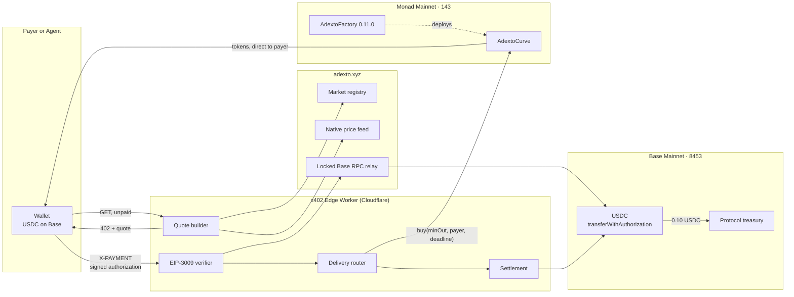
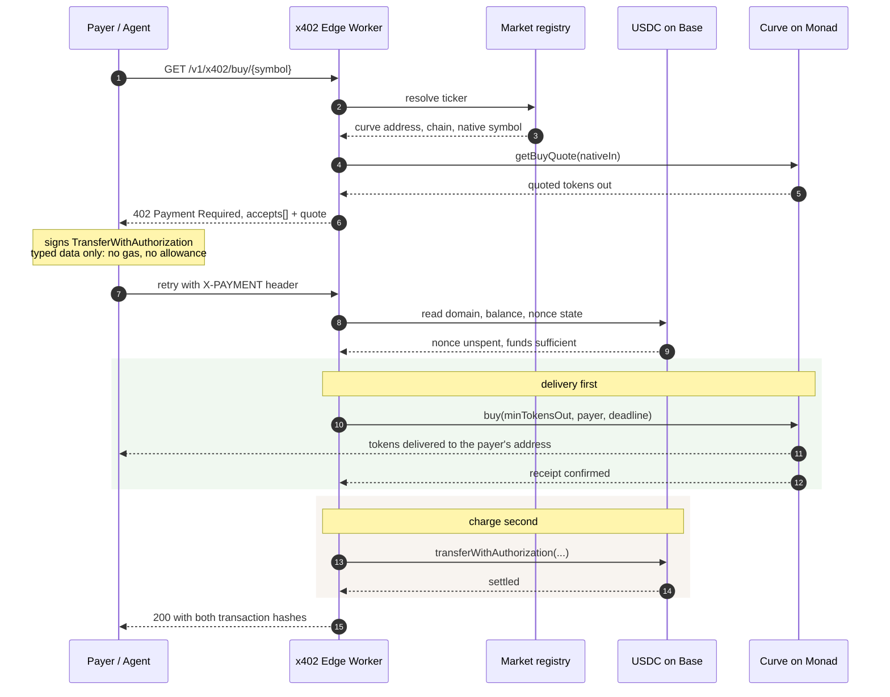
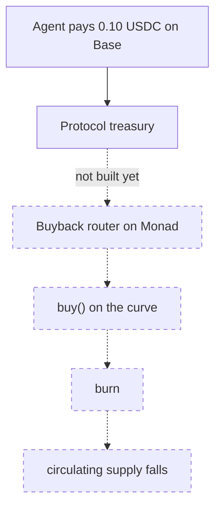
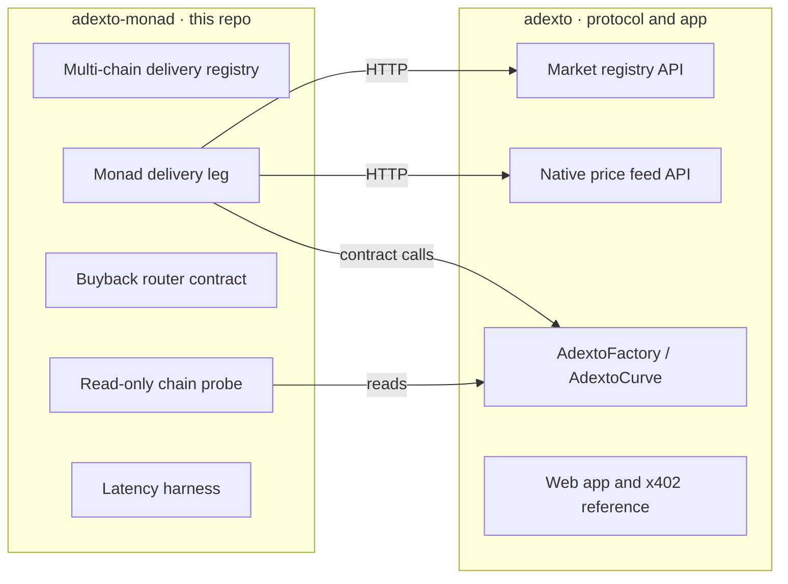

# adexto-monad

**Pay USDC on Base. Receive a bonding-curve token on Monad. One HTTP request.**


A market can only live on one chain. A buyer's money does not have to.

This repository holds the **Monad delivery leg** for ADEXTO's x402 cross-chain buys: an
HTTP endpoint that quotes a purchase, takes a USDC payment on Base through a signed
transfer authorization, and has the bonding curve on Monad deliver the tokens straight
to the payer's own address. No bridge. No need to hold MON for gas. No custody at any
point in the path.

> **Honesty first.** The payment machinery is live and has moved real money, but its
> delivery target today is 0G, not Monad. Retargeting it at Monad is what this repository
> is being built for. Every claim below is marked with what backs it, and the
> [status matrix](#status) separates what runs from what does not.

---

## Contents

- [Why this exists](#why-this-exists)
- [Architecture](#architecture)
- [The fill lifecycle](#the-fill-lifecycle)
- [Why delivery runs before the charge](#why-delivery-runs-before-the-charge)
- [The value loop](#the-value-loop)
- [Status](#status)
- [Verified on chain](#verified-on-chain)
- [Contract call traps](#contract-call-traps)
- [Quickstart](#quickstart)
- [Repository boundary](#repository-boundary)
- [Metropolis submission](#metropolis-submission)

---

## Why this exists

To buy a token whose market lives on Monad, a buyer holding USDC elsewhere normally has
to do three separate things before they can trade at all:

1. Bridge the funds and wait for the bridge.
2. Acquire MON, because the trade itself needs gas in the chain's native asset.
3. Find the market and execute.

Three steps, one waiting period, and a gas asset the buyer never wanted to hold. For a
human that is friction. For an autonomous agent it is usually a hard stop, because each
step needs a different integration and at least one of them typically needs a human.

This collapses all three into a single paid HTTP request. The buyer signs one typed-data
authorization for USDC on Base — not a transaction, so no gas and no allowance — and the
curve on Monad sends the tokens to their address.

---

## Architecture



Three properties of that picture are load-bearing, and each one closes a specific way the
design could be abused:

**The market is never chosen by the caller.** A request names a ticker. The curve address
behind it is resolved through the registry, so a caller cannot point protocol funds at an
arbitrary contract. An earlier draft of the parent worker accepted a payee from a request
header, which would have let the caller redirect the money outright.

**Base is reached through a locked relay, not a public RPC.** Measured from inside a
Cloudflare Worker, every public Base endpoint tried rate-limited the shared egress IP:
`drpc` returned 429, `publicnode` returned `-32005`, `1rpc` returned `-32001`,
`mainnet.base.org` returned `-32016`, `llamarpc` returned 525. The relay allowlists a
small set of JSON-RPC methods, refuses batches, and requires a shared key.

**The signing domain is read from the token, not from the request.** Taking the EIP-712
domain from caller-supplied fields would let a payer choose values that make an otherwise
invalid signature verify.

---

## The fill lifecycle



---

## Why delivery runs before the charge

The two legs land on different chains and nothing on-chain binds them together, so one of
them has to go first. That ordering decides who absorbs a failure.

| Order | If the second leg fails | Who pays |
| --- | --- | --- |
| Charge, then deliver | Protocol holds the buyer's USDC and owes them tokens | **the buyer** |
| Deliver, then charge | Protocol spent its own native balance and collected nothing | **the protocol** |

The second is the only acceptable direction, and it also matches what the x402
specification recommends: verify, serve, settle. A failed fill costs us and never the
buyer.

This is worth stating plainly rather than dressing up: **the two legs are not atomic.**
The buyer carries no funds risk, because no charge is taken until a delivery has already
succeeded. What they do rely on is the operator submitting that buy. That dependency is
real and is not hidden behind the word "trustless".

One consequence is handled explicitly in code. The 0G RPC has been observed answering
`-32000 no matching receipts found` for transactions that were already mined, which
`tx.wait()` surfaces as a coalescing error. That exact behaviour once caused a successful
delivery to be recorded as a failure, so the buyer received tokens and was never charged.
Receipts are therefore polled with retries, and if a receipt still cannot be read the
response is `202` with the hash and no charge — never a claim of failure, and never a
charge without confirmation.

---

## The value loop



The vault and its burn path already exist on-chain and anyone can trigger a burn. What
does not exist is the leg that feeds it from x402 revenue: today the USDC reaches the
treasury address and is rebalanced by hand. Closing that loop is task 3 in the plan, and
the dashed edges above stay dashed until it ships.

---

## Status

| Component | State | Evidence |
| --- | --- | --- |
| `AdextoFactory` 0.11.0 live on Monad | **verified** | read from chain, see below |
| `deployTrinity` path on Monad | **simulated, passing** | `staticCall` + `estimateGas`, no broadcast |
| Any market on Monad | **none yet** | `totalProjectsCount` is `0` |
| x402 quote, 402 challenge | **live** | parent worker |
| EIP-3009 settlement with real funds | **verified** | Base tx below |
| Cross-chain fill end to end | **verified on 0G** | two tx below, 16.2s round trip |
| Replay protection | **verified** | reused authorization refused |
| Monad as a delivery target | **not built** | worker is single-chain today |
| Buyback and burn routing | **not built** | vault exists, endpoint does not feed it |
| Monad indexing | **not built** | subgraph covers Base and Arbitrum only |

---

## Verified on chain

Read back with `npm run probe`, not copied from notes. Re-run it before quoting any of
this, because chain state moves.

### Monad Mainnet · 143

```
AdextoFactory        0x5800e9715a47a598fce9bc3B65a95FD6BeBf76A3
  VERSION            0.11.0
  bytecode           21,281 bytes
  PROTOCOL_FEE_BPS   10
  MAX_SUPPLY         1_000_000_000_000   (whole tokens, not wei)
  ANTI_SNIPER_BPS    100
  AGENT_REGISTRY     0x8004A169FB4a3325136EB29fA0ceB6D2e539a432
  protocolTreasury   0x24268Fffc119ec5550F68e80D94476fD64daE967
  totalProjectsCount 0

deployTrinity        simulated clean
  gas                3,159,443
  cost               ~0.322 MON at 102 gwei
```

### 0G Mainnet · 16661 — the proven benchmark

```
AdextoFactory        0x51c4168226463F7e5A141e1c6D30520734BC840a
  VERSION            0.11.0        (identical bytecode length to Monad)
  totalProjectsCount 2

deployTrinity        simulated clean
  gas                3,168,379
  cost               ~0.0127 0G at 4 gwei
```

0G is kept in the registry on purpose. It is the only delivery target whose payment path
has been proven with real funds, so it is the number every Monad claim gets measured
against instead of being measured against a hope.

### The cross-chain buy that actually happened

One request produced both legs. `-0.02 USDC` from the payer, `+0.02 USDC` to the
treasury, tokens delivered above the quoted floor, 16.2 seconds end to end. The price has
since been raised to `0.10 USDC` because the measured margin at `0.02` was negative once
gas on both chains was counted.

| Leg | Chain | Transaction |
| --- | --- | --- |
| Payment | Base | [`0x65a79f7b…8a62190`](https://basescan.org/tx/0x65a79f7b35fb755aee92da2bb11703df1045955188df352ab4dcfc9b18a62190) |
| Delivery | 0G | [`0x7a1583a3…02e6d7daf`](https://chainscan.0g.ai/tx/0x7a1583a34e7abd49347b2686bf7c63cf0344f39ec565d85df73ffb502e6d7daf) |
| Settlement-only test | Base | [`0x470494bd…6d75049d2`](https://basescan.org/tx/0x470494bd9b1401cd7e9a9ede88dc54011d96ea8d2e06624445d7b216d75049d2) |

Replaying a spent authorization is refused with `invalid_transaction_state`, and no second
transfer is broadcast.

---

## Contract call traps

Both of these revert, and neither is obvious from the function signature. They cost one
debugging round each while writing the probe, so they are written down.

**`initialSupply` is denominated in whole tokens, not wei.** `MAX_SUPPLY` is `1e12` whole
tokens, so passing `parseEther("1000000000")` overshoots it and the call reverts with
`Factory: bad supply`.

**`agentIdentity` must not be the zero address, even when `bindAgent` is `false`.** The
requirement is checked before the agent-binding branch, so a launch with no agent still
has to name an address. Otherwise: `Factory: zero agent`.

The remaining guards, for reference:

| Guard | Rule |
| --- | --- |
| `symbol` | 1–12 bytes, unique per chain |
| `name` | 1–64 bytes |
| `virtualNative` | must be greater than zero |
| `swapFeeBps` | `swapFeeBps + PROTOCOL_FEE_BPS <= 500` |
| shares | `creatorShareBps + treasuryShareBps <= swapFeeBps` |
| `agentId` | must be `0` unless `bindAgent` is set |
| agent ownership | with `bindAgent`, registry `ownerOf(agentId)` must be the caller |

---

## Quickstart

Requires Node 22.6 or newer. TypeScript runs directly through Node's native type
stripping, so there is no build step and no bundler.

```bash
npm install

# read Monad and simulate the launch path. Nothing is broadcast.
npm run probe

# the proven benchmark, for comparison
node scripts/probe.ts 0g

# simulate as a specific address, and print its balance
PROBE_FROM=0xYourAddress npm run probe

npm run typecheck
```

The probe is read-only by construction. It uses `staticCall` and `estimateGas`, which run
the function on a node and discard the result, so a broken path reverts without spending
gas. That matters more on mainnet than it sounds: a test token created by accident cannot
be deleted afterwards.

---

## Repository boundary



The curve, the factory, the registry and the web app stay in
[`0xcuy/adexto`](https://github.com/0xcuy/adexto). Copying them here would create two
sources of truth for one deployed contract, which is the failure this project already
spent effort eliminating elsewhere. This repository consumes them over the same public
APIs the production worker uses.

---

## Metropolis submission

Built for [Monad Metropolis](https://monad.xyz/developers/hackathons/metropolis), build
window 1 September to 13 October 2026.

- **Track:** 01 — Onchain Finance & Trading
- **Why that track:** the curve is a market structure, not a payments product. It opens
  against a virtual reserve so no liquidity deposit is needed, never graduates to an
  external pool, has no owner and no withdrawal function, and pays the creator out of swap
  flow instead of an allocation. The evidence behind it is financial: real transactions and
  measured round-trip economics.

What was built inside the window, with dated commits in the parent repository:

| Work | Commit | Date |
| --- | --- | --- |
| Curve and factory 0.11.0, additive protocol fee leg | `cebed46` | 2026-09-07 |
| 0.11.0 broadcast to all four mainnets, Monad included | `e5fa698` | 2026-09-07 |
| x402 turned into a cross-chain buy product | `e095163` | 2026-09-10 |
| `/x402` integration reference page | `7f1ac4a` | 2026-09-10 |

What predates the window, and is therefore **not** claimed as new: the bonding-curve
concept with its earlier factory generations `0.9.0` and `0.10.0`, and the application
shell — studio, explorer, swap, token terminal and wallet layer. Those are existing
infrastructure this work builds on.

---

## License

MIT
