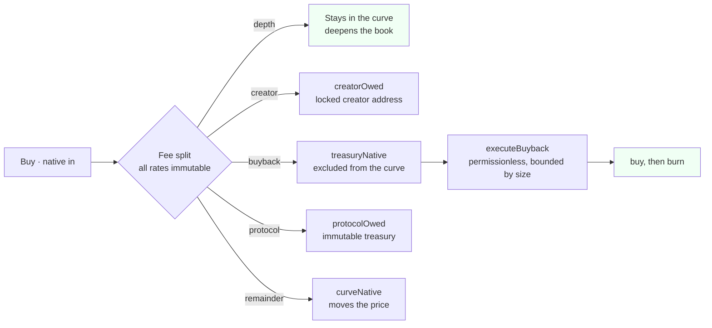
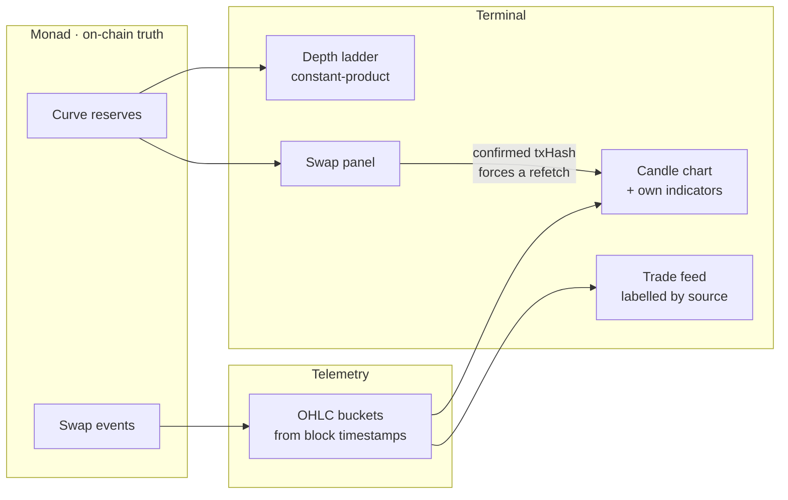
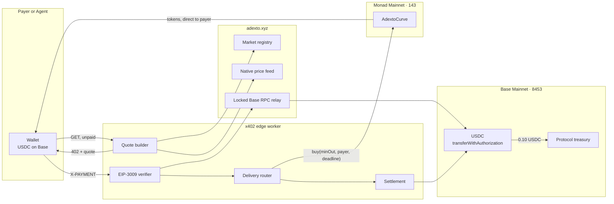
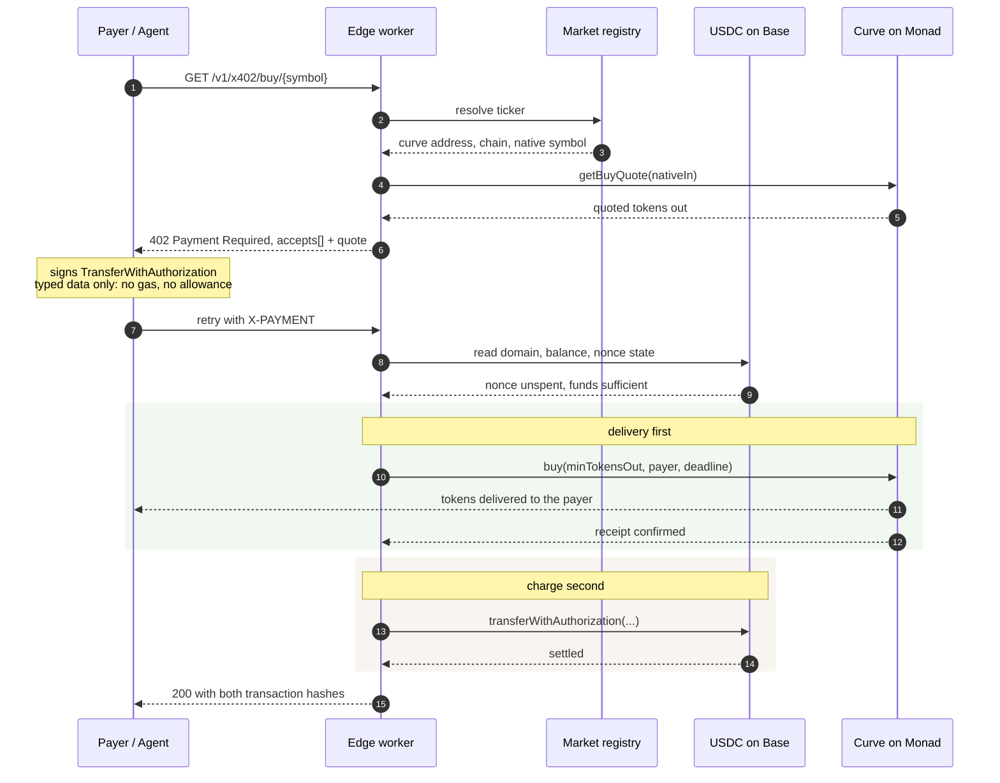
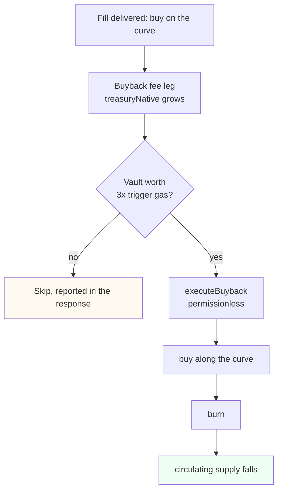
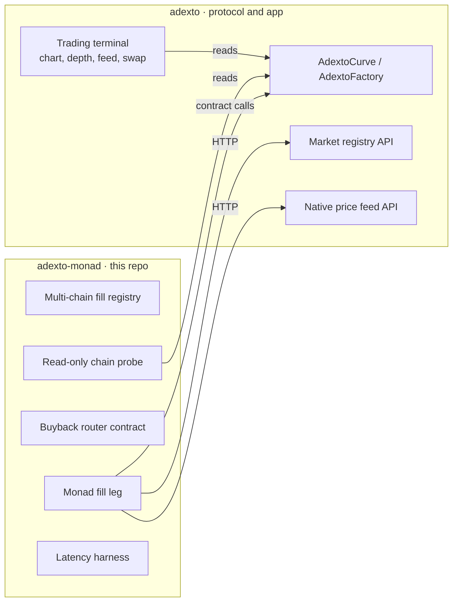

# adexto-monad

**A bonding-curve market that opens on Monad with no liquidity deposit, is tradable from
the first block, and can be bought into from another chain.**


Launching a token normally means funding a pool before anyone can trade it. That deposit
is the real barrier, not the gas: it has to be paid per chain, it is the thing a creator
can pull, and it is why most launch venues end up custodial in practice.

This one opens a market against a **virtual reserve**. There is no deposit, 100% of supply
enters the curve at genesis, the curve *is* the permanent venue — no graduation step, no
external pool, no owner, and no withdrawal function anywhere on the path. Every fee rate is
`immutable`. The creator earns from swap flow instead of holding an allocation.

On top of that sits a trading terminal built for markets that are minutes old, and an
HTTP on-ramp that lets a buyer on another chain take a position without bridging.

> **Where each piece lives.** This repository holds the Monad-specific engineering: the
> multi-chain delivery registry, the Monad fill leg, the buyback router, and a read-only
> chain probe. The curve, factory, registry API and the trading terminal live in
> [`0xcuy/adexto`](https://github.com/0xcuy/adexto) and are consumed over public APIs.
> Duplicating them here would create two sources of truth for one deployed contract.
>
> **Status, stated plainly.** Both halves now run on Monad with real funds. A market is live —
> [**$PARCEL**](#the-live-monad-market), launched from this factory and tradable in the terminal
> — and a buyer holding only USDC on Base can take a position in it without bridging and
> without ever holding MON: [two paid fills](#the-cross-chain-buys-that-actually-happened) have
> settled on Base and delivered on Monad. The same router now delivers on all four mainnets,
> and an AI agent can complete a purchase through an MCP server — with the signing key named
> rather than glossed over. Monad is indexed too —
> [Envio HyperIndex](#indexing-monad-with-envio), full history, verified against chain. The
> [status matrix](#status) separates what runs from what does not.

---

## Contents

- [The live Monad market — $PARCEL](#the-live-monad-market)
- [The market structure](#the-market-structure)
- [The trading surface](#the-trading-surface)
- [Why Monad, specifically](#why-monad-specifically)
- [Reaching a Monad market from another chain](#reaching-a-monad-market-from-another-chain)
- [Why delivery runs before the charge](#why-delivery-runs-before-the-charge)
- [The value loop](#the-value-loop)
- [Indexing Monad with Envio](#indexing-monad-with-envio)
- [Status](#status)
- [Verified on chain](#verified-on-chain)
- [Contract call traps](#contract-call-traps)
- [Quickstart](#quickstart)
- [Repository boundary](#repository-boundary)
- [Metropolis submission](#metropolis-submission)

---

## The live Monad market

**Open the terminal:
[`adexto.xyz/token/parcel?chain=143&tf=900`](https://adexto.xyz/token/parcel?chain=143&tf=900)**

This is the reference market for everything below. It was created through the production
studio at `adexto.xyz` — not a script and not a local build — so every screen a judge can
open is the same screen that produced it. One transaction created the token, its curve and
its full supply, with no liquidity deposit at any point.

| | |
| --- | --- |
| Token | [`0xC0B02176D37C1a64A6B493335115dB5D6D645E1F`](https://monadscan.com/address/0xC0B02176D37C1a64A6B493335115dB5D6D645E1F) |
| Curve | [`0x36F2E236Bd37830BbF52c1248DeE28770C8F4eCb`](https://monadscan.com/address/0x36F2E236Bd37830BbF52c1248DeE28770C8F4eCb) |
| Launch tx | [`0x876dbd3b…10ea4396`](https://monadscan.com/tx/0x876dbd3bb9013c87720ee570fc1b988234a3b8f9686a1555f0f4dd8a10ea4396) |
| Block · time | `103878638` · 2026-09-11 10:59:53 UTC |
| Launch cost | `3,229,629` gas — **0.329422158 MON** at 102 gwei, gas only |
| Supply | `1,000,000,000` PARCEL, 100% in the curve |
| Opening reserve | `virtualNative` 174,888.464882 MON, virtual — never deposited |
| Fee legs | depth 15 · creator 10 · buyback 5 bps, plus 10 bps protocol charged on top |
| Agent | ERC-8004 `agentId` 10251, bound at creation, `agentBound` true |

**Timeframes at the link.** `tf=3600` opens hourly candles, which is the widest view this
market can currently fill. `tf=1` is where a market this young actually reads: five fills
produce 116 one-second bars against 4 at one minute, because the sub-minute bucket is the
only one that gives each fill its own candle.

### The five trades, on chain

All five are real swaps against the curve, executed through the terminal and the `/swap` page
in one recorded session. `buy · buy · sell · buy · buy`, which is a shape a market makes
rather than a demo script that only ever buys.

| # | Side | Block | Amount | Transaction |
| --- | --- | --- | --- | --- |
| 1 | BUY | `103878737` | 0.035 MON → 199.3270 PARCEL | [`0xaa6a4df7…3ec23363`](https://monadscan.com/tx/0xaa6a4df7776aa4e705a8a5ff3aa83b2e85b71a008dad23b5ff8cc6983ec23363) |
| 2 | BUY | `103878794` | 0.035 MON → 199.3269 PARCEL | [`0xa1ceaf56…ef37b424`](https://monadscan.com/tx/0xa1ceaf56b63c57d910f92f2cdb7b008551debac5b5e98bbed6c679a9ef37b424) |
| 3 | SELL | `103878829` | 132.8846 PARCEL → 0.023147 MON | [`0x11608ef6…71b70abe`](https://monadscan.com/tx/0x11608ef6fbcc487614a89e108c436ef9449681bd36822f8f2ea1268371b70abe) |
| 4 | BUY | `103878904` | 0.035 MON → 199.3269 PARCEL | [`0x2c58de3c…809ea66d`](https://monadscan.com/tx/0x2c58de3c3f8fc32e2b4533a2ff8df8cd0f9e953cc428e30c93fa4133809ea66d) |
| 5 | BUY | `103878924` | 0.06125 MON → 348.8219 PARCEL | [`0x81c1de1a…1e155502`](https://monadscan.com/tx/0x81c1de1af5271719ca4882b7865f370ee0e2f7e1000e4dea87adc06d1e155502) |

The sell is the row that matters. It went through `approve` then `sell` against the curve,
which is the exit path a bonding curve is usually accused of not having — there is no
graduation to an external pool here, so the curve has to be the venue in both directions or
the market is a trap.

Curve state immediately after that session, read back from the contract:

```
swapCount           5
treasuryNative      0.000094745003093472 MON   accrued to the buyback vault
creatorOwed         0.00009625 MON             accrued from swap flow
```

**Read again today it says `swapCount 12`, and the extra fills are the point rather than a
correction.** Two of them are the [cross-chain x402 buys](#the-cross-chain-buys-that-actually-happened)
and the rest are ordinary trading since. An x402 delivery is an ordinary `buy` against this
curve, so it pays the same fee legs as anything else and the counter moves. Nothing separate
had to be wired for that.

```
swapCount           12
treasuryNative      0.004416353983441502 MON   grew 46x on the fills since
creatorOwed         0.008739467960696060 MON
protocolOwed        0.008832707966883004 MON
totalVolumeNative   8.832707966883005472 MON
```

The buyback vault filling up on its own is worth noticing: `treasuryNative` is fillable only
by the curve's own buyback fee leg, and the x402 fills paid it without anything routing
revenue anywhere. `totalTokensBurned` is still `0` because the burn fires on a gas threshold,
which is the gate working rather than a gap — and it is worth saying plainly that the
threshold has never been crossed on this market, so the burn is proven on 0G and not here.

Checkable without trusting any of the above: the protocol leg is 10 bps of gross volume, so
`totalVolumeNative / 1000` should equal `protocolOwed` while nothing has been claimed.
`8832707966883005472 / 1000` is `8832707966883005`, against `8832707966883004` stored — one wei
of integer truncation, which is the arithmetic agreeing rather than a discrepancy.

### Measured settlement cost, not estimated

Track 01 is judged on economics, so these are receipts rather than estimates. Every one is
`status=1`.

| Action | Gas | Cost at 102 gwei |
| --- | --- | --- |
| Launch — token + curve + supply, one tx | `3,229,629` | 0.329422158 MON |
| First buy on a cold curve | `324,307` | 0.033079314 MON |
| Steady-state buy | `119,851` | 0.012224802 MON |
| Sell, including the `approve` leg | `145,288` | 0.014819376 MON |
| **Five swaps, total** | — | **0.08667858 MON** |

The first buy costs 2.7× a later one because it writes storage slots that do not exist yet on
a curve nobody has touched. Quoting the cold number as typical would overstate the cost of
trading here by almost three times, which is why both are listed separately rather than
averaged into one figure.

Whole session, launch plus five trades: **0.416 MON**, gas only, no deposit at any point.

Creator revenue accrued from those swaps and was **claimed to zero** during the same session.
That is the whole creator model: paid out of flow, never holding an allocation, so there is no
supply overhang to disclose.

### Why the history is stored rather than re-scanned

The trade feed reads a stored copy of these five swaps, and the label says `on-chain` because
each record carries its own `txHash`, `blockNumber` and block timestamp — verifiable one row
at a time in the table above.

That indirection is a Monad-specific constraint, not a shortcut. Monad's RPC caps
`eth_getLogs` at **100 blocks per call**. With a 16-call budget per page load, the reachable
window is 1,600 blocks — roughly eight minutes — so a live scan cannot see this market's own
launch, and raising the budget would mean hundreds of sequential RPC calls for one page view.
The swaps are therefore read once from chain and persisted. **The indexer that removes the
reason for that store now exists** — see [Indexing Monad with Envio](#indexing-monad-with-envio).

### $CURB, and why the count is 2

`totalProjectsCount` on the Monad factory reads `2`. The other launch is `$CURB`
([`0x8AB19c43…`](https://monadscan.com/address/0x8AB19c43Dc0b66240BF1404A6e78135C14836eE0)),
the first market opened here. It was replaced by `$PARCEL` and its registry row was pulled, so
it is no longer listed on the site.

Nothing was taken from it, and that distinction is worth stating rather than glossing: the
curve still holds its reserves — nothing can be withdrawn from a curve — it is still tradable
directly against the contract, and the ticker stays claimed on this factory permanently
because `symbolRegistry` has no release function. `totalProjectsCount` cannot fall either.
Every launch that exists on chain is accounted for once in
[`src/config/onchain-launches.json`](https://github.com/0xcuy/adexto/blob/main/src/config/onchain-launches.json)
in the parent repo, and its consistency audit fails the build if an on-chain launch appears
that the file does not explain.

---

## The market structure

The curve is a constant-product AMM whose native side opens at a number in storage rather
than a balance in the contract:

```
nativeReserve = virtualNative + curveNative        curveNative starts at 0
k             = nativeReserve * tokenReserve
```

Because 100% of supply enters the curve at genesis, `virtualNative` **is** the opening
market cap — not an approximation of it. Solvency is proven by construction rather than by
policy: `k / (tokenReserve - sold) >= virtualNative` holds for every reachable state, so
the curve can always pay out what it owes.

Four fee legs, and every rate is `immutable` with no setter and no admin:



What each leg buys you, and why the split is inside the total rather than added on top:

| Leg | Accrues to | Who can move it |
| --- | --- | --- |
| depth | the curve itself | nobody — it is reserve |
| creator | `creatorOwed` | the creator address locked at launch |
| buyback | `treasuryNative`, excluded from reserve | **anyone**, via `executeBuyback` |
| protocol | `protocolOwed` | claimable only to an `immutable protocolTreasury` |

Three properties follow, and they are the reason this is a market primitive rather than a
launch button:

**Native leaves only two ways.** A seller's payout, or a fee claim. There is no
`withdraw`, no `sweep`, no `rescue`, and no owner to call one. That is what makes the curve
a venue instead of a custody arrangement.

**Buyback is permissionless.** `executeBuyback` is bounded by size, not by identity, so the
burn path does not depend on the team being alive or willing.

**Nothing about the economics can be changed after launch.** Rates are `immutable` at
construction. A governor contract is deployed on all four chains and controls exactly
nothing, because there is no setter for it to call.

---

## The trading surface

A market that is four minutes old cannot be charted by an embed. A TradingView or
GeckoTerminal frame resolves a symbol against that provider's database, and a token
launched from this factory minutes ago is in neither — so the embed renders empty. The
terminal therefore computes its own indicators from the same candles it draws.



**Sub-minute candles, because a newborn curve trades per second.** Timeframes run
`1s · 5s · 15s · 1m · 5m · 15m · 1h · 4h · 1d · 1y`. On a one-minute bucket, a buy then a
sell then a buy inside the same minute collapse into a single candle whose close is
whichever happened last — which describes the minute but hides the market.

**Indicators are computed, not embedded.** `lightweight-charts` is TradingView's renderer
but ships no indicators, so overlays and panes are derived locally: EMA 9, EMA 21, SMA 50,
Bollinger 20,2 and VWAP as overlays; RSI 14 and MACD 12,26,9 as panes.

**An under-warmed indicator is not drawn.** RSI(14) needs 15 bars and MACD needs 34. Below
that the series is a gap and the footer states how many bars are still missing. A
half-warmed average rendered as a confident line is the same class of lie as an invented
candle, and this is where most young-market charts quietly break.

**Depth is the real clearing price.** The ladder is computed with the same constant-product
formula the contract executes, so a level's price is what a trade of that size would
actually clear at — not `spot × (1 ± i × 0.002)` with a flat size per level, which is what
it used to be. When no executable pool exists it says so instead of inventing depth.

**Fills are labelled by source.** Genesis seeding is never presented as live market
activity, and `AUTO_BUYBACK` is distinguished from a trader's `BUY`. Each row links to the
explorer for its own `chainId` rather than guessing from a chain-name substring.

**A confirmed trade updates the chart immediately.** Polling runs every 15 seconds; without
an override, someone who just sold would watch a chart with no sign of their fill. The
refetch is keyed on the transaction hash and fires after the receipt is parsed, so the swap
log is already in a block when the data is re-read.

**Market cap has no footnote.** With 100% of supply in the curve, no locked portion and no
creator allocation, MCAP and FDV are the same number.

---

## Why Monad, specifically

This product is unusually sensitive to settlement, which is what makes the chain choice
substantive rather than a deployment target.

**Sub-second finality is what makes a 1-second candle mean anything.** The chart's shortest
buckets are only useful if trades actually confirm inside them. On a chain with multi-second
finality, a `1s` timeframe is a row of gaps pretending to be a market.

**The terminal reads block timestamps, not the wall clock.** Trade times come from the block
a fill landed in, so a chain whose blocks are dense produces candles that reflect sequence
rather than approximation.

**Cheap gas is what makes a deposit-free launch honest.** Removing the liquidity deposit
only helps if what remains is genuinely small. Launch cost was measured, not assumed:

| Chain | Launch gas | Cost | Gas price |
| --- | --- | --- | --- |
| Monad | 3,159,443 | ~0.322 MON | 102 gwei |
| 0G | 3,168,379 | ~0.0127 0G | 4 gwei |

Identical factory bytecode on both, so that difference is chain economics rather than a
code difference. It is recorded because per-fill delivery cost on Monad has to be
**re-measured** rather than assumed to match 0G — the same mistake that made the first
cross-chain price unprofitable, described [below](#the-value-loop).

---

## Reaching a Monad market from another chain

A market can only live on one chain. A buyer's money does not have to.

Without this, buying into a Monad market while holding USDC elsewhere means bridging,
waiting, acquiring MON for gas, and then trading. Three steps and a gas asset the buyer
never wanted. For an autonomous agent it is usually a hard stop, because each step needs a
different integration and at least one typically needs a human.

The on-ramp collapses that into one paid HTTP request. The buyer signs a single EIP-3009
transfer authorization for USDC on Base — typed data, not a transaction, so no gas and no
allowance — and the curve on Monad delivers the tokens to their own address.





Three properties of that path are load-bearing, and each closes a specific abuse:

**The market is never chosen by the caller.** A request names a ticker; the curve address
behind it is resolved through the registry. An earlier draft accepted the payee from a
request header, which would have let the caller redirect the money outright.

**The signing domain is read from the token, not the request.** Taking the EIP-712 domain
from caller-supplied fields would let a payer choose values that make an invalid signature
verify.

**Base is reached through a locked relay, not a public RPC.** Measured from inside a
Cloudflare Worker, every public Base endpoint rate-limited the shared egress: `drpc` 429,
`publicnode` `-32005`, `1rpc` `-32001`, `mainnet.base.org` `-32016`, `llamarpc` 525. The
relay allowlists a small method set, refuses batches, and requires a shared key.

---

## Why delivery runs before the charge

The two legs land on different chains and nothing on-chain binds them, so one has to go
first. That ordering decides who absorbs a failure.

| Order | If the second leg fails | Who pays |
| --- | --- | --- |
| Charge, then deliver | Protocol holds the buyer's USDC and owes them tokens | **the buyer** |
| Deliver, then charge | Protocol spent its own native balance and collected nothing | **the protocol** |

The second is the only acceptable direction, and it matches what the x402 specification
recommends: verify, serve, settle.

Stated plainly rather than dressed up: **the two legs are not atomic.** The buyer carries
no funds risk, because no charge is taken until a delivery has already succeeded. What they
do rely on is the operator submitting that buy. That dependency is real and is not hidden
behind the word "trustless".

One consequence is handled explicitly in code. A 0G RPC node was observed answering
`-32000 no matching receipts found` for a transaction that had already been mined, which
`tx.wait()` surfaces as a coalescing error. That exact behaviour once recorded a successful
delivery as a failure, so a buyer received tokens and was never charged. Receipts are now
polled with retries, and an unreadable receipt returns `202` with the hash and no charge —
never a claim of failure, and never a charge without confirmation.

---

## The value loop



There is nothing to route. `treasuryNative` can only be filled by the curve's own
buyback fee leg — no external transfer can add to it — and an x402 delivery is itself a
`buy`, so it pays that leg and the vault grows on every fill.

What was actually missing was smaller than it looked: **nobody had ever called
`executeBuyback`.** Read from chain before this shipped, `totalTokensBurned` was `0` on
both live markets while the vault had been accruing for 20 swaps.

The threshold is the part worth explaining. One `executeBuyback` call costs roughly
`0.0005 0G` in gas, and the vault accrues `0.000257 0G` per fill — so burning on every
fill would spend about twice the value it destroyed. Autonomous does not mean *every
time*; it means *no human decides*. The edge compares the vault against the live gas
price and burns once it is worth at least 3x the trigger cost, so no burn ever costs
more than it destroys, and every response reports the decision with its numbers.

**Supply has already fallen.** The first buyback spent the vault in full and destroyed
`7.110759702852663544 $ADEXTO`, moving total supply from `999,999,925.841335527761992555`
to `999,999,918.730575824909329011`. Confirmed by reading `totalTokensBurned` on the
curve and `totalSupply` on the token before and after, not from the receipt alone:
[`0x792023ab…8ab66bc5`](https://chainscan.0g.ai/tx/0x792023abdcf0ce1af431cb717a874e0344d1e3f8b84223aeddeaff008ab66bc5).

Pricing that loop was got wrong once, and it is worth recording because the error is
instructive. The first live price was `0.02 USDC` per fill:

| Component | Value |
| --- | --- |
| Revenue at 0.02 USDC, 3% spread | ~$0.0006 |
| Base settlement gas | $0.00128 |
| Delivery gas on the target chain | $0.00008 |
| **Net margin on the first real fill** | **−$0.00075** |

The spread had been sized against trade value while the dominant cost was **settlement gas
on the payment chain**, which is independent of trade size. Break-even sat near `$0.05`, so
the price moved to `0.10 USDC`, where a 3% spread yields roughly `+$0.0016` per fill.

---

## Status

| Component | State | Evidence |
| --- | --- | --- |
| Curve with immutable fee legs, no deposit, no owner | **live, 4 mainnets** | factory `0.11.0` |
| `AdextoFactory` 0.11.0 on Monad | **verified** | read from chain, below |
| `deployTrinity` path on Monad | **executed on mainnet** | [`0x876dbd3b…`](https://monadscan.com/tx/0x876dbd3bb9013c87720ee570fc1b988234a3b8f9686a1555f0f4dd8a10ea4396), 3,229,629 gas, 0.3294 MON |
| A market on Monad | **live and traded** | [$PARCEL](#the-live-monad-market) — `totalProjectsCount` is `2`, `swapCount` now `12` |
| Buying and selling on Monad | **both proven** | the first five swaps include an `approve` + `sell` exit; seven more have landed since |
| Creator revenue on Monad | **accrued and claimed** | claimed to zero in the same session |
| Trading terminal: chart, depth, feed, swap | **live on Monad** | [terminal link](https://adexto.xyz/token/parcel?chain=143&tf=900) |
| Permissionless buyback and burn | **live on-chain** | `executeBuyback` has no caller gate, verified by simulating it from a random address |
| x402 quote and 402 challenge | **live** | edge worker |
| EIP-3009 settlement with real funds | **verified** | Base tx below |
| Cross-chain fill end to end | **verified on all four mainnets** | [four tx below](#the-cross-chain-buys-that-actually-happened) for Monad and 0G, 10.8s and 11.8s on Monad; Arbitrum and Base followed once they had markets — hashes in the [parent README](https://github.com/0xcuy/adexto#-honest-status) |
| Replay protection | **verified** | reused authorization refused |
| Monad as a fill target | **live, paid twice** | delivery RPC is chosen per market chain; `48,125.53 $PARCEL` delivered for `0.20 USDC` |
| An AI agent completing the purchase | **live, and the signer is named** | seven MCP tools at [`adexto.xyz/api/mcp`](https://adexto.xyz/mcp). An agent on `zerog/glm-5.3` discovered a market, quoted it and bought it. The EIP-3009 authorization is signed by the **operator's key on the server**, not by the agent — so the claim is that the agent decided and executed, not that it paid from its own funds |
| Payer needs MON or a bridge | **no** | the payer signs an EIP-3009 authorization and sends no transaction; tokens arrive straight from the curve |
| Automated buyback and burn | **live, supply has fallen** | `7.110759702852663544 $ADEXTO` destroyed, vault spent to zero — [tx](https://chainscan.0g.ai/tx/0x792023abdcf0ce1af431cb717a874e0344d1e3f8b84223aeddeaff008ab66bc5) |
| Monad indexing | **live, and publicly queryable** | [Envio HyperIndex](#indexing-monad-with-envio) — full history, [anonymous read-only GraphQL](#query-it-yourself-no-account-and-no-key), every row checked against chain |

---

## Indexing Monad with Envio

Source: [`envio/`](https://github.com/0xcuy/adexto/tree/main/envio) in the parent repo. Indexes
`AdextoFactory` 0.11.0 and every curve it deploys — launches, swaps, buyback burns, fee claims,
ERC-8004 bindings.

### Why a separate indexer and not one more network on the subgraph

The Graph does not serve Monad. Checked against `graphprotocol/networks-registry`, `monad` is
listed **without** Subgraphs support — Firehose and Substreams only — so Studio will not accept
it however the manifest is written. The alternative was running our own Graph Node for Monad,
which means maintaining tens of GB of chain state.

### Why HyperSync and not RPC

Measured both ways in one sitting, same block range, same handlers:

| Source | Full history from the factory's deploy block |
| --- | --- |
| HyperSync | 1.93M blocks in **under 45 seconds**, 0 warnings, 0 errors |
| `rpc.monad.xyz` | ~83 blocks/sec → **about 6 hours** |

The six-hour figure is not a criticism of the RPC, it is the
[100-block cap](#why-the-history-is-stored-rather-than-re-scanned) doing arithmetic: 1.93M
blocks divided by a 100-block `eth_getLogs` window is roughly 19,200 sequential calls. That is
the same constraint that limits a live scan to about eight minutes, seen from the other end.

RPC stays configured as a fallback. Worth being precise about what that covers: a HyperSync that
answers badly, **not** one that never authenticates. With no `ENVIO_API_TOKEN` the indexer stops
on the first fetch rather than quietly degrading.

### Query it yourself, no account and no key

```bash
curl -s -X POST https://adexto.xyz/api/indexer/graphql \
  -H 'content-type: application/json' \
  -d '{"query":"{ Curve { id swapCount volumeNative totalProtocolFees } Swap_aggregate { aggregate { count } } }"}'
```

`GET` the same URL for the entity list and the live sync position. Introspection is on, so any
GraphQL client can explore the schema.

Read-only is enforced by the database role, not by the endpoint: unauthenticated requests map
to a role with `select` permissions only, so the public schema has no mutation root — a
`mutation` is answered with `no mutations exist`. Hasura's own admin surfaces, `/v1/metadata`
and `/v2/query`, are not reachable through it.

### Verified against contract storage, not against itself

An indexer that is internally consistent can still be uniformly wrong, so every figure was
compared with what the curve contract stores — including the live fee ledger
(`treasuryNative`, `creatorOwed`, `protocolOwed`) rather than only derived totals.

Read from the curves today. `$CURB` is frozen because it stopped being traded when it was
delisted; `$PARCEL` keeps moving, so **these are the values at the time of writing and not
constants** — the check that matters is the method, and re-running it should produce newer
numbers that still agree with each other.

| | $CURB | $PARCEL |
| --- | --- | --- |
| `swapCount` | 5 | 12 |
| `totalVolumeNative` | `104240006234326264` | `8832707966883005472` |
| `totalDepthFeesRetained` | `156360009351489` | `13249061950324507` |
| `treasuryNative` | `52120003117163` | `4416353983441502` |
| `creatorOwed` | `11000000000000` | `8739467960696060` |
| `protocolOwed` | `104240006234326` | `8832707966883004` |
| `totalTokensBurned` | `0` | `0` |
| ERC-8004 | agent `10251` | agent `10251` |

**Two of the twenty-two comparisons did not match on the first run, and that is the useful
part.** Sell volume was short by exactly `92,960,024,747,776` wei on $PARCEL and
`92,960,024,937,304` on $CURB — in both cases precisely the 40 bps of fees on the one sell leg.
The handler was reading the sell event's `amountOut`, the native the seller actually receives
after fees, while `buy()` counts `msg.value`, which is gross. The same trade size was
registering as two different volumes depending on direction.

The contract had this bug first and already fixed it; the comment on
`totalVolumeNative += leaving + depthFee` in `AdextoCurve.sol` says so. Checkable without
trusting any of this: the protocol leg is 10 bps of gross volume, so `totalVolumeNative / 1000`
on chain equals `totalProtocolFees`. It does, on both markets. After the fix all twenty-two
match.

`$CURB` is indexed even though it is [no longer listed](#curb-and-why-the-count-is-2). It sits
at `projectAt(0)` permanently, so an indexer reporting one launch would be wrong about the chain
— and that is the first number anyone can check with a single `eth_call`. Delisting is a registry
decision; indexing is a question of what exists.

### What the schema is careful about

Each of these is a place where a plausible implementation reports a wrong number without raising
an error.

- **`openingPriceNative` is derived, never copied from `CurveInitialized.openingPrice`.** That
  parameter is the raw contract value, wei per 1e18-token. Copying it would put three fields
  whose names all end in `PriceNative` into two units that differ by 1e18.
- **`protocolFee` is not added to `totalDepthFees`.** The depth slice settles inside the curve
  and is what lifts the price floor; the protocol slice leaves it. Summing both reports a floor
  higher than the curve can pay.
- **`agentBound` is stored explicitly, not derived from `agentId != 0`.** Agent id 0 is a real
  agent owned by someone on all four mainnets.
- **`AgentBinding` is its own entity**, because the factory emits `AgentBound` *before*
  `TrinityProjectDeployed` — `Project` does not exist yet when the binding arrives.
- **A buyback increments `swapCount`**, matching the contract. Not following it would make the
  on-chain and indexed counters differ forever.
- **Zero is never accepted as a candle low.** A zero price only means the token reserve is
  empty; letting it through drops every candle to zero.
- **`ProtocolFeeClaim` records both `to` and `caller`.** `claimProtocolFees()` is
  permissionless, so storing both is the only way to show the destination cannot be hijacked by
  whoever triggers it.

No handler makes a contract call. Everything needed is already in the events, and an `eth_call`
would reintroduce the per-block RPC dependency this exists to escape.

---

## Verified on chain

Read back with `npm run probe`, not copied from notes. Re-run before quoting any of it.

### Monad Mainnet · 143

```
AdextoFactory        0x5800e9715a47a598fce9bc3B65a95FD6BeBf76A3
  VERSION            0.11.0
  bytecode           21,281 bytes
  PROTOCOL_FEE_BPS   10
  MAX_SUPPLY         1_000_000_000_000   (whole tokens, not wei)
  ANTI_SNIPER_BPS    100
  AGENT_REGISTRY     0x8004A169FB4a3325136EB29fA0ceB6D2e539a432
  protocolTreasury   0x24268Fffc119ec5550F68e80D94476fD64daE967
  totalProjectsCount 2

deployTrinity        EXECUTED, 3,229,629 gas, 0.329422158 MON at 102 gwei
                     0x876dbd3bb9013c87720ee570fc1b988234a3b8f9686a1555f0f4dd8a10ea4396

allProjects(0)       0x8AB19c43Dc0b66240BF1404A6e78135C14836eE0   $CURB    delisted
allProjects(1)       0xC0B02176D37C1a64A6B493335115dB5D6D645E1F   $PARCEL  live
```

`allProjects(i)` returns the **token**, not the curve. Reading it the other way round puts
the two addresses in the wrong fields, and both respond to enough calls that the mistake does
not announce itself.

The simulation that preceded this predicted 3,159,443 gas against 3,229,629 actually used —
2.2% under. Recorded because the estimate is quoted elsewhere in this file's history, and a
prediction is worth less once the real number exists.

```
$PARCEL curve       0x36F2E236Bd37830BbF52c1248DeE28770C8F4eCb
  virtualNative      174888.464882 MON     virtual, never deposited
  swapCount          12                    5 by hand, 2 paid over x402, 5 since
  depthFeeBps        15
  creatorFeeBps      10
  treasuryBuybackBps 5
  treasuryNative     0.004416353983441502 MON
  creatorOwed        0.008739467960696060 MON
  protocolOwed       0.008832707966883004 MON
  totalVolumeNative  8.832707966883005472 MON
  totalTokensBurned  0                     vault below the gas threshold

$PARCEL token       0xC0B02176D37C1a64A6B493335115dB5D6D645E1F
  symbol             PARCEL
  name               Parcel Market
  totalSupply        1000000000.0
  agentBound         true
  agentId            10251
```

### 0G Mainnet · 16661 — the proven benchmark

```
AdextoFactory        0x51c4168226463F7e5A141e1c6D30520734BC840a
  VERSION            0.11.0        (identical bytecode length to Monad)
  totalProjectsCount 3             $ADEXTO, $ADT, $ZEEBO

deployTrinity        simulated clean, 3,168,379 gas, ~0.0127 0G at 4 gwei
```

0G stays in the registry on purpose. It was the first fill target whose payment path was
proven with real funds, and it is still where the burn path is proven, so it is the number
every Monad claim gets measured against instead of being measured against a hope.

**One thing Monad now has that 0G does not: a live market with an ERC-8004 binding.** The
first `$ADEXTO` market on 0G was bound to `agentId 3545431`, and relaunching it onto the
`0.11.0` factory to gain the protocol fee leg sent `bindAgent: false` — hard-coded in the
relaunch script. `agentBound` is `immutable`, so the live `$ADEXTO` at
[`0xA1358C17…1DF7`](https://chainscan.0g.ai/address/0xA1358C17004469C7CA5365AbafD294F9b2c11DF7)
reads `agentBound false` permanently. `$PARCEL` and `$CURB` here read `agentBound true,
agentId 10251` and were never relaunched, so Monad is where that property is still
observable on a listed market. The script is fixed and now refuses to launch unbound when
the market it replaces was bound, but the fix cannot reach a market that already exists.

**All four mainnets are now fill targets, and that changes what Monad is being compared to.**
`DELIVERY_RPC` in the worker maps a market's `chainId` to its own endpoint, so Base and
Arbitrum became targets by getting a market rather than by getting new code. Read back from
chain, all `status 1`, all submitted by the relayer `0xDe1f5e5505c01aC6C847146fF76E0e067A49C627`:
`$WOMBO` delivered on Arbitrum at block `505674141`, `$BLOOP` at Base block `51375604`, and
`$ZEEBO` on 0G at block `44560323` with its settlement on Base at `51419336`. Monad is no
longer the only chain proving the router — it is the chain where the router was first proven
against something other than 0G.

### The cross-chain buys that actually happened

Each row is one HTTP request that moved money on two chains. Every figure below was read from
the transaction logs, not from the gateway's response — a 200 says the call did not throw,
which is not the same as a token arriving.

**Delivered on Monad.** The payer held USDC on Base, no MON, and signed nothing but an
authorization.

| # | Paid on Base | Delivered on Monad | Received | Round trip |
| --- | --- | --- | --- | --- |
| 1 | [`0xf95c7c66…7290f190`](https://basescan.org/tx/0xf95c7c66fab2fbc5b56b902fccba583d5f3def1538a8891883766b4e7290f190) | [`0x4df10f36…bd67088e`](https://monadscan.com/tx/0x4df10f36232107e52dbb925f9c056435ec4806d8068e00a84d732ba1bd67088e) | `24,091.244065390845787333 $PARCEL` | 11.8s |
| 2 | [`0xfb744ca0…1b78f5da`](https://basescan.org/tx/0xfb744ca03aa5e755c297e7f1c088407dd55786023334f53d6cad10fb1b78f5da) | [`0x2b9540f8…aaf21e08`](https://monadscan.com/tx/0x2b9540f8bc2f34030d23d83b4ae7d96e5d687c8780a12d1cb2643677aaf21e08) | `24,034.289690016296025975 $PARCEL` | 10.8s |

Read from the logs of those four transactions: both deliveries `status 1`, `99,888` gas each,
and in each one the `Transfer` moves `$PARCEL` **from the curve straight to the payer** — there
is no hop through an address we control, which is what "no custody" means here rather than a
promise. On Base, `0.100000 USDC` leaves the payer and arrives at the treasury, exactly the
quoted price, in `85,780` gas.

**The delivery block is 6 and 7 seconds EARLIER than its settlement block.** That is not a
timing artefact, it is [the ordering](#why-delivery-runs-before-the-charge) made visible: the
tokens are sent before the charge is taken, so a delivery that fails costs us and never the
buyer. The two block timestamps are the cheapest way to check that claim.

**Delivered on 0G**, the leg that was proven first and is kept because it proves something
different — that the payment path worked before delivery could reach more than one chain.

| Leg | Chain | Transaction |
| --- | --- | --- |
| Payment | Base | [`0x65a79f7b…8a62190`](https://basescan.org/tx/0x65a79f7b35fb755aee92da2bb11703df1045955188df352ab4dcfc9b18a62190) |
| Delivery | 0G | [`0x7a1583a3…02e6d7daf`](https://chainscan.0g.ai/tx/0x7a1583a34e7abd49347b2686bf7c63cf0344f39ec565d85df73ffb502e6d7daf) |
| Settlement-only test | Base | [`0x470494bd…6d75049d2`](https://basescan.org/tx/0x470494bd9b1401cd7e9a9ede88dc54011d96ea8d2e06624445d7b216d75049d2) |

Replaying a spent authorization is refused with `invalid_transaction_state`, and no second
transfer is broadcast.

**Reproducible, which it was not before.** These are produced by
[`scripts/x402-buy.mts`](https://github.com/0xcuy/adexto/blob/main/scripts/x402-buy.mts) in the
parent repo: it reads the 402 challenge, signs the authorization, resends with `X-PAYMENT`, then
verifies by reading both chains. Until it existed, the first two purchases were cited as
evidence while nothing in either repo could re-derive them — the strongest claim resting on two
hashes nobody could reproduce, including us. The signing deliberately uses a public Base RPC
rather than our own relay, because a buyer should need none of our infrastructure.

**What the payer never needed:** MON, a bridge, an account, an API key, or a transaction of
their own.

---

## Contract call traps

Both revert, and neither is visible in the function signature. They cost one debugging
round each while writing the probe.

**`initialSupply` is denominated in whole tokens, not wei.** `MAX_SUPPLY` is `1e12` whole
tokens, so `parseEther("1000000000")` overshoots it and reverts with
`Factory: bad supply`.

**`agentIdentity` must not be the zero address, even when `bindAgent` is `false`.** The
check runs before the agent-binding branch, so a launch with no agent still has to name an
address. Otherwise: `Factory: zero agent`.

| Guard | Rule |
| --- | --- |
| `symbol` | 1–12 bytes, unique per chain, claimed **permanently** |
| `name` | 1–64 bytes |
| `virtualNative` | greater than zero |
| `swapFeeBps` | `swapFeeBps + PROTOCOL_FEE_BPS <= 500` |
| shares | `creatorShareBps + treasuryShareBps <= swapFeeBps` |
| `agentId` | `0` unless `bindAgent` is set |
| agent ownership | with `bindAgent`, registry `ownerOf(agentId)` must be the caller |

`symbolRegistry` has no setter and no owner, so a ticker claimed on Monad is claimed there
forever. That is not a theoretical risk: `ADEXTO` is permanently claimed on 0G, so its
launch can never be recorded on that chain again.

---

## Quickstart

Requires Node 22.6 or newer. TypeScript runs through Node's native type stripping, so there
is no build step and no bundler.

```bash
npm install

# read Monad and simulate the launch path. Nothing is broadcast.
npm run probe

# the proven benchmark, for comparison
node scripts/probe.ts 0g

# simulate as a specific address, and print its balance
PROBE_FROM=0xYourAddress npm run probe

npm run typecheck
```

The probe is read-only by construction: `staticCall` and `estimateGas` run the function on a
node and discard the result, so a broken path reverts without spending gas. That matters
more on mainnet than it sounds, because a test token created by accident cannot be deleted.

---

## Repository boundary



---

## Metropolis submission

Built for [Monad Metropolis](https://monad.xyz/developers/hackathons/metropolis), build
window 1 September to 13 October 2026.

**Track 01 — Onchain Finance & Trading.** The track asks for new asset primitives, market
structures and trading experiences enabled by fast, cheap settlement. All three are the
subject here: a curve that opens without a deposit and cannot be withdrawn from, a terminal
built for markets minutes old, and settlement economics measured rather than asserted.

Track 04 was rejected deliberately. Its core is trust, provenance and user-owned data, and
this project does not do provenance — the 0G router's Intel TDX attestation is read as a
declaration and never verified here, which is why the parent repo's claim guard already bans
the phrase `Hardware Attested`. Entering that track would invite claims its own tooling
forbids.

Built inside the window, with dated commits in the parent repository:

| Work | Commit | Date |
| --- | --- | --- |
| Curve and factory 0.11.0, additive protocol fee leg | `cebed46` | 2026-09-07 |
| 0.11.0 broadcast to all four mainnets, Monad included | `e5fa698` | 2026-09-07 |
| Cross-chain buy on-ramp | `e095163` | 2026-09-10 |
| Integration reference page | `7f1ac4a` | 2026-09-10 |
| ERC-8004 agent registered on Monad, `agentId` 10251 | `0x09f1f8bf…` on chain | 2026-09-11 |
| **First market opened on Monad** and traded | `0x876dbd3b…` on chain | 2026-09-11 |
| **$PARCEL launched through the live site** and traded five times | [see above](#the-live-monad-market) | 2026-09-11 |
| Candle width made independent of bar count across every market | `dfad26a` | 2026-09-11 |
| Monad read path cached and parallelised — 4.5s to 1.96s cold, 0.003s warm | `d47e246` | 2026-09-11 |
| Two paid cross-chain fills delivered on Monad, proven with real funds | `ad0f432` | 2026-09-13 |
| **Monad indexed with Envio HyperIndex**, full history from the deploy block | `acc8601` | 2026-09-13 |
| Terminal serves Monad history from the indexer, indexer runs as a service | `2ce989d` | 2026-09-14 |
| **Indexer public, anonymous and read-only** at `/api/indexer/graphql` | `e790bcc` | 2026-09-14 |
| **Monad reads moved to Alchemy** — `eth_getLogs` span 100 → 500,000 | `de4de50` | 2026-09-14 |
| Keyed Alchemy endpoint removed after measuring it worse than the shared one | `b23782f` | 2026-09-14 |

The last two are listed because they are Monad-specific engineering rather than cosmetics.
Monad's 100-block `eth_getLogs` cap meant the terminal re-ran sixteen sequential calls on
every request and cached none of them, since the zero-result path returned before the cache
was written — measured at five 4-second reads per thirty idle seconds against 38 ms for the
same page on 0G. The chain with the narrowest log window was the only one whose reads were
never remembered.

Predating the window, and therefore **not** claimed as new: the bonding-curve concept with
its earlier factory generations `0.9.0` and `0.10.0`, and the application shell — studio,
explorer, swap, terminal and wallet layer. Those are existing infrastructure this work
builds on.

### Outside recognition, and why it is listed separately

Selection into a programme is **not** engineering, so it is deliberately kept out of the table
above rather than padding it. It is recorded here because one part of it concerns this chain.

ADEXTO was presented at the **0G Atlas Founder House Demo Day on 18 September 2026**, one of
eight projects named in the announcement, and what was presented is the venue as it actually
runs — four mainnets, Monad among them. 0G also published a landscape of that ecosystem and
placed the project in its markets and coordination layer, **tagged for Base, Arbitrum and
Monad**. That tag is the part worth pointing at: it is the first time the multi-chain
deployment has been stated by someone other than this project.

The link between a demo given elsewhere and the market on this chain is checkable rather than
rhetorical. `AdextoFactory` `0.11.0` runtime bytecode is **byte-identical on all four
mainnets** — 21,281 bytes, keccak
`0xcbb89e32ae973400723287f16f32e87f039efcef1c1f814c5805bd1a6fe3add8`, read back with
`eth_getCode` from each chain rather than compared against a local build. So the launch and
trade path shown there is the same bytecode that serves
[`$PARCEL`](#the-live-monad-market), not a port of it. Hash
[the Monad factory](https://monadscan.com/address/0x5800e9715a47a598fce9bc3B65a95FD6BeBf76A3)
and check.

All three artefacts, each with its source and with the places where the publishers' wording
differs from ours, are collected at
[**adexto.xyz/recognition**](https://adexto.xyz/recognition). Two of them — the Demo Day
announcement and the landscape map — are from the Bali house; the third is a 0G developer
showcase from Zero Gravity Taipei, a **different event**, and it is presented as such rather
than folded in to make one appearance look like two.

Two things stated plainly because they cut the other way. The publishers describe this as a
launchpad; we do not, because a launchpad hands over a token and a page while one transaction
here opens a market that trades from its first block. And the showcase slide carries a footnote
that on-chain volume is still very low and that this project states it cannot independently
verify raw TDX quotes — both true, both already in this repository's own documentation, and
quoted on that page rather than cropped out.

Recorded in the Metropolis Progress Updates tab as update #8, posted 21 September 2026, whose
opening item is the Alchemy work above rather than the event.

---

## License

MIT
