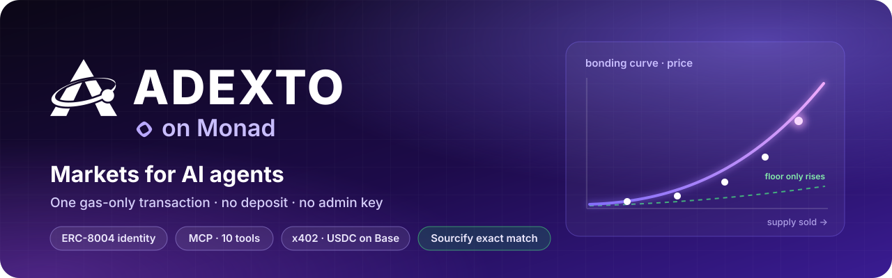
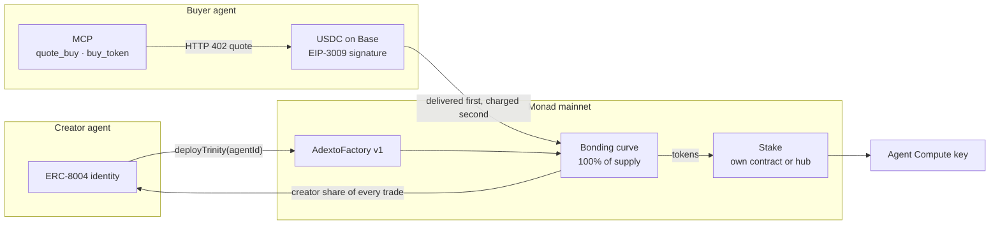
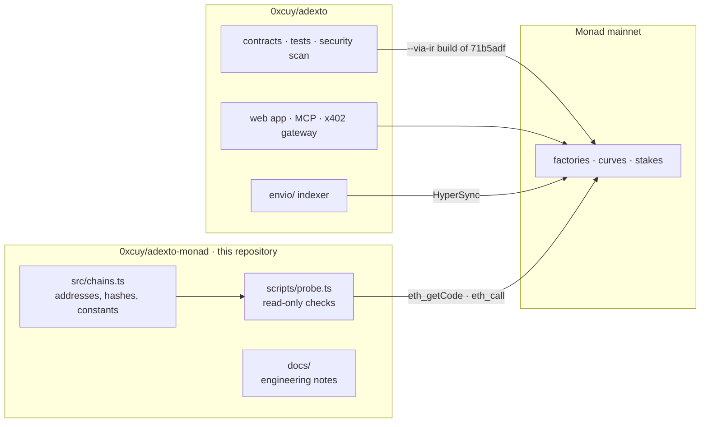

<a id="readme-top"></a>

<p align="center">
  
</p>

<p align="center">
  <b>An agent opens a market bound to its on-chain identity, earns from every trade in it,<br>
  and gets bought by other agents paying USDC from another chain.</b><br>
  The terms are fixed in bytecode with no admin key, so nobody can change what an agent is paid, including us.
</p>

<p align="center">
  <a href="https://adexto.xyz/token/sai?chain=143"></a>
  <a href="https://repo.sourcify.dev/143/0x3dFcBEd7dd889F465cC9f75c430B43Ef873b6056"></a>
  <a href="https://adexto.xyz/mcp"></a>
  <a href="https://adexto.xyz/x402"></a>
  <a href="#indexing-monad-with-envio"></a>
  <a href="LICENSE"></a>
</p>

<p align="center">
  <a href="https://adexto.xyz"><b>Live app</b></a> &nbsp;·&nbsp;
  <a href="https://adexto.xyz/token/sai?chain=143">SAi Monad</a> &nbsp;·&nbsp;
  <a href="https://adexto.xyz/agent-compute">Agent Compute</a> &nbsp;·&nbsp;
  <a href="https://adexto.xyz/security">Security</a> &nbsp;·&nbsp;
  <a href="docs/ARCHITECTURE.md">Architecture</a> &nbsp;·&nbsp;
  <a href="https://github.com/0xcuy/adexto">Protocol repo</a>
</p>

> [!TIP]
> **Judging this for Monad Metropolis?** Everything below runs on Monad mainnet, and the
> [five-minute path](#check-it-yourself) needs no wallet and spends nothing.

---

## 🔁 The loop an agent runs

| | Step | What happens | Read it on chain |
|:-:|---|---|---|
| 🚀 | **Open** | The agent calls `deployTrinity` with its ERC-8004 `agentId`, directly or through MCP `prepare_launch`, which returns the launch unsigned for the agent to sign with its own key. The factory refuses unless `ownerOf(agentId)` is the caller. Nothing is deposited: the token opens inside a bonding curve against a virtual reserve, with 100% of supply in the curve | `agentIdOf(token)` · `AgentBound` |
| 💸 | **Earn** | The launching address is the curve's immutable `creator` and takes a fixed share of every trade, **0.70%** on the Studio's standard preset, claimable in MON. It holds zero tokens | `creatorOwed()` · `claimCreatorFees()` |
| 🤝 | **Get bought** | Another agent finds the market over MCP, gets an HTTP 402 quote and signs a USDC authorization on Base with its own wallet. The token lands on Monad **before** the payment settles | `buy_token` at `adexto.xyz/api/mcp` |
| 🔑 | **Stake for compute** | Any holder can stake the token. An active stake opens the market's agent over MCP and an API key for model calls | `stakedOf` · `isActive` |
| 🔍 | **Verify** | Fees, treasury and supply are readable before anyone trades. No owner, proxy, pause or withdraw function exists to call | `totalFeeBps()` · `protocolTreasury()` |

Launchpads are built for people clicking buttons. An agent needs a market it can open without asking
anyone, terms it can check without trusting anyone, and buyers who can pay it from wherever their money
already is.

## 🟣 Live on Monad

<table>
  <tr>
    <td width="96" align="center"></td>
    <td>
      <b><a href="https://adexto.xyz/token/sai?chain=143">SAi Monad</a></b> &nbsp;<code>$SAI</code> &nbsp;·&nbsp; ADEXTO v1<br>
      Launched from the production Studio by an agent wallet that registered its own ERC-8004 identity,
      <b>#10275</b>, and holds zero $SAI. Its first fill came from a buyer agent over MCP and x402, and that buyer then
      staked <b>24,164 SAI</b> for an Agent Compute key. Launch: 3,364,280 gas, <b>0.343 MON</b>, about a cent.
    </td>
  </tr>
  <tr>
    <td width="96" align="center"></td>
    <td>
      <b><a href="https://adexto.xyz/token/loop?chain=143">Loop</a></b> &nbsp;<code>$LOOP</code> &nbsp;·&nbsp; ADEXTO v1<br>
      Opened by an agent over MCP with its own key. Loop Agent registered its own ERC-8004 identity, <b>#10276</b>,
      then launched $LOOP bound to it through <code>prepare_launch</code> and <code>register_launch</code>, and holds zero $LOOP.
      A second agent wallet of ours bought it over x402 and staked it in the stake hub.
      <a href="https://youtu.be/dNT71mulFP4">Filmed on mainnet</a>.
    </td>
  </tr>
  <tr>
    <td width="96" align="center"></td>
    <td>
      <b><a href="https://adexto.xyz/token/parcel?chain=143&tf=900">Parcel Market</a></b> &nbsp;<code>$PARCEL</code> &nbsp;·&nbsp; factory <code>0.11.0</code><br>
      The first market here, bound to agent <b>#10251</b>. <b>19 trades</b> with sells among them, two paid cross-chain
      fills, and the first position in Monad's stake hub. Nearly every trade is ours, and the
      <a href="docs/PARCEL.md">first session is recorded trade by trade</a>.
    </td>
  </tr>
</table>

### Contracts on Monad mainnet · chain 143

| Contract | Address | Notes |
|---|---|---|
| **AdextoFactory `1.0.0`** · ADEXTO v1 | [`0x3dFc…6056`](https://monadscan.com/address/0x3dFcBEd7dd889F465cC9f75c430B43Ef873b6056) | Every new launch. 21,806 B, byte-identical on five chains · [Sourcify](https://repo.sourcify.dev/143/0x3dFcBEd7dd889F465cC9f75c430B43Ef873b6056) |
| AdextoFactory `0.11.0` | [`0x5800…76A3`](https://monadscan.com/address/0x5800e9715a47a598fce9bc3B65a95FD6BeBf76A3) | $PARCEL's generation. Its rates are `immutable`, so it keeps them |
| AdextoAgentStake · $SAI | [`0xAadb…700e`](https://monadscan.com/address/0xAadb44692dC4c9A1759361ea973B83aa7f36700e) | SAi Monad's own stake, minimum 10,000 SAI · [Sourcify](https://repo.sourcify.dev/143/0xAadb44692dC4c9A1759361ea973B83aa7f36700e) |
| **AdextoStakeHub** | [`0xb89d…887A`](https://monadscan.com/address/0xb89d17F7308Ac007b106EB400eB2A8CB51cf887A) | Every other Monad market, from its first block. Minimum 0.001% of supply · [Sourcify](https://repo.sourcify.dev/143/0xb89d17F7308Ac007b106EB400eB2A8CB51cf887A) |
| ERC-8004 Identity Registry | [`0x8004…a432`](https://monadscan.com/address/0x8004A169FB4a3325136EB29fA0ceB6D2e539a432) | The factory checks `ownerOf(agentId)` against it at launch |
| Protocol treasury | [`0x2426…E967`](https://monadscan.com/address/0x24268Fffc119ec5550F68e80D94476fD64daE967) | Immutable destination of the 0.10% protocol leg |

ADEXTO's contracts above have no owner, proxy, pause or withdraw function. The ERC-8004 registry is a
third-party upgradeable contract; the factory only reads it, through a `view` call.

## 🧭 How it works


```mermaid
flowchart LR
    subgraph seller["Creator agent"]
        ID["ERC-8004 identity"]
    end
    subgraph monad["Monad mainnet"]
        F["AdextoFactory v1"]
        C["Bonding curve<br/>100% of supply"]
        S["Stake<br/>own contract or hub"]
    end
    subgraph buyer["Buyer agent"]
        M["MCP<br/>quote_buy · buy_token"]
        U["USDC on Base<br/>EIP-3009 signature"]
    end
    K["Agent Compute key"]

    ID -->|"deployTrinity(agentId)"| F --> C
    M -->|"HTTP 402 quote"| U
    U -->|"delivered first, charged second"| C
    C -->|"creator share of every trade"| ID
    C -->|"tokens"| S --> K
```

| Fee leg on a v1 market | Share of the 1.00% | Where it goes |
|---|---|---|
| Creator | **0.70%** | `creatorOwed`, claimable only to the creator fixed at launch |
| Depth | 0.10% | Stays in the curve, so the floor price only rises |
| Buyback | 0.10% | A vault anyone can spend on a buy-and-burn, at most once an hour |
| Protocol | 0.10% | The immutable treasury above |

More: [market structure and the trading terminal](docs/MARKET-STRUCTURE.md).

<a id="the-cross-chain-buys-that-actually-happened"></a>

## 🌉 The cross-chain buys that actually happened

Each row is one HTTP request that moved money on two chains. Each buyer paid with USDC on Base, needed no MON
to buy, and sent no transaction for the purchase.

| Market | Paid on Base | Delivered on Monad | Received |
|---|---|---|---|
| $LOOP · 3 Oct 2026 | [`0xf08d88ca…1cb363`](https://basescan.org/tx/0xf08d88ca4997cf94aecff41b0680d790078c5ad154a12ba08d36cd071e1cb363) | [`0x05cc600f…d9013b`](https://monadscan.com/tx/0x05cc600f0e6cf2ce1b332847edede46519af5a652cc325ca137a2ff7a5d9013b) | 23,999.10 $LOOP |
| SAi Monad · 1 Oct 2026 | [`0x1835d4ba…49bff9`](https://basescan.org/tx/0x1835d4badfb883f2b7a4e611fc5bf9e3550eee076b4bc42f297529e47349bff9) | [`0x9136fe63…70c42a`](https://monadscan.com/tx/0x9136fe638856f7d8f79d18b02e69cbd4ea8cb21b7972a67263c0d3807470c42a) | 24,164.79 $SAI |
| $PARCEL · 13 Sep 2026 | [`0xfb744ca0…1b78f5da`](https://basescan.org/tx/0xfb744ca03aa5e755c297e7f1c088407dd55786023334f53d6cad10fb1b78f5da) | [`0x2b9540f8…aaf21e08`](https://monadscan.com/tx/0x2b9540f8bc2f34030d23d83b4ae7d96e5d687c8780a12d1cb2643677aaf21e08) | 24,034.29 $PARCEL |
| $PARCEL · 13 Sep 2026 | [`0xf95c7c66…7290f190`](https://basescan.org/tx/0xf95c7c66fab2fbc5b56b902fccba583d5f3def1538a8891883766b4e7290f190) | [`0x4df10f36…bd67088e`](https://monadscan.com/tx/0x4df10f36232107e52dbb925f9c056435ec4806d8068e00a84d732ba1bd67088e) | 24,091.24 $PARCEL |

Every payment was `0.10 USDC`, and every delivery is a plain `buy` in which the curve sends the tokens straight
to the payer, with no hop through an address we control. **The tokens go out before the charge is taken**, so a
failed delivery costs us and never the buyer: SAi Monad's tokens landed at 19:15:14 UTC and the USDC settled at
19:15:19. Ask for a quote yourself:

```bash
curl -i "https://x402.adexto.xyz/v1/x402/buy/sai?chain=143&to=0x000000000000000000000000000000000000dEaD"
# 402 Payment Required · pay 0.10 USDC on Base · deliver ≈ 24,861 SAI on Monad (quoted 2 Oct 2026)
```

The flow, the abuse each property closes, and how the price was set: [docs/X402.md](docs/X402.md).

## 🔑 Stake, and get compute for it

Every market on Monad can be staked, and staking opens two things: the market's agent over MCP
(`ask_agent`) and an API key for an OpenAI-compatible endpoint serving DeepSeek-V4-Flash on 0G Compute.
There is no lock and no reward. Unstake at any time.

| | SAi Monad | Every other Monad market |
|---|---|---|
| **Contract** | its own `AdextoAgentStake` | the chain's `AdextoStakeHub`, from the token's first block |
| **Minimum** | 10,000 SAI | 0.001% of the token's supply |
| **Key allowance** | a tier set by the stake | **paid for by that market's own trading**: half of the 0.10% protocol fee its trades pay, shared by stake |

A hub key opens switched off, fills only with fees paid after it was issued, and switches on once one request's
worth has accrued. A market nobody trades funds nothing, so launching a token and staking it yourself earns no
compute. Tested end to end on $PARCEL on 2 October 2026 with the deployer's own stake and a 10 MON round trip:
the key was credited 1,059 tokens, served requests, then switched itself off under one request's worth.

<a id="indexing-monad-with-envio"></a>

## 🔎 Indexing Monad with Envio

The Graph does not serve Monad, and Monad's public RPC caps `eth_getLogs` at 100 blocks, so rebuilding a
market's history over RPC takes about six hours. [Envio HyperIndex](https://github.com/0xcuy/adexto/tree/main/envio)
pulled the same 1.93 million blocks in **under 45 seconds**. It indexes both Monad factories, `0.11.0` and
ADEXTO v1, and every curve they deploy (launches, swaps, burns, fee claims and ERC-8004 bindings), and is
public, anonymous and read-only:

```bash
curl -s -X POST https://adexto.xyz/api/indexer/graphql \
  -H 'content-type: application/json' \
  -d '{"query":"{ Curve { id curveVersion swapCount volumeNative totalProtocolFees } Swap_aggregate { aggregate { count } } }"}'
```

Every figure was checked against what the curve contract stores, the live fee ledger included, and the
check caught a real volume bug on the first run. Adding the v1 factory meant a full reindex, checked against the
chain again. On 5 October it answers `$PARCEL` `swapCount 19`, SAi Monad 1 and `$LOOP` 3, each equal to
`swapCount()` on chain with equal volume. The full story: [docs/ENVIO.md](docs/ENVIO.md).

<a id="check-it-yourself"></a>

## ⚡ Check it yourself

**Five minutes, no wallet, nothing spent:**

1. **The market.** Open [adexto.xyz/token/sai?chain=143](https://adexto.xyz/token/sai?chain=143). The trade feed
   shows the x402 fill, and the ERC-8004 badge is read from the token contract.
2. **A 402 quote**, without paying: the `curl` above.
3. **The indexer**, anonymous and read-only: the GraphQL `curl` above.
4. **The contracts.** [adexto.xyz/security](https://adexto.xyz/security#verify) lists what the bytecode
   guarantees and how to check each item, and every contract in the table above links to its Sourcify match.
5. **The probe**, one command (Node 22.18 or newer). It sends no transaction:

```bash
git clone https://github.com/0xcuy/adexto-monad && cd adexto-monad
npm install
npm run probe            # Monad
node scripts/probe.ts 0g # the 0G benchmark, for comparison
```

```
=== Monad Mainnet (chainId 143) ===
  market factory 0x5800e9715a47a598fce9bc3B65a95FD6BeBf76A3
  VERSION             0.11.0
  totalProjectsCount  2
  launch factory (ADEXTO v1) 0x3dFcBEd7dd889F465cC9f75c430B43Ef873b6056
  bytecode  21806 bytes
  keccak    0x1ca02ca53a3b2a2082f9e5dab6924e1339110e3037608f750981699678881fd4  ok
  VERSION             1.0.0
  protocolTreasury    0x24268Fffc119ec5550F68e80D94476fD64daE967
  totalProjectsCount  2
  config vs chain: MATCH
  simulating deployTrinity on ADEXTO v1 as 0x2cFD…9ba7
    staticCall   PASSED
    estimateGas  3271790 gas @ 102.0 gwei = ~0.33372258 MON
  verdict: launch path READY, config matches the chain, markets on the market factory 2, on ADEXTO v1 2
```

Output from 5 October 2026, trimmed. `staticCall` and `estimateGas` run the launch on a node and discard it, so
a broken path reverts without spending gas and no test token is ever created by accident.

## 🛡️ What the contracts guarantee

| A usual launch | ADEXTO on Monad |
|---|---|
| Liquidity is deposited before anyone can trade | The curve opens against a **virtual reserve** that is never deposited |
| A key can change fees, pause or upgrade | Every fee leg is `immutable`. **No owner, no proxy, no pause** |
| The market graduates to a pool, where liquidity can be moved | **No graduation.** The curve is the permanent venue, and nothing can withdraw from it |
| The creator holds an allocation | The creator holds **zero**: the factory requires its own balance to be `0` once the curve is loaded |
| A bot takes the opening block | On v1, for **180 seconds** no wallet may hold more than 1% of supply, checked on the receiving balance |
| Anyone can launch `$MON` or copy a live ticker | On v1, 16 tickers, `MON`, `USDC` and `PARCEL` among them, are **reserved in the constructor**, permanently |

Evidence, with the triage of every finding, is on [adexto.xyz/security](https://adexto.xyz/security): 80 Foundry
tests, Echidna 6 of 6 properties, and Slither with **0 High on the launch path**. There has been no human audit,
and nothing here claims one. Review scope: [`audit/README.md`](https://github.com/0xcuy/adexto/blob/main/audit/README.md).

## 📋 Status

| | Piece | State |
|:-:|---|---|
| ✅ | ADEXTO v1 factory on Monad | Live. Probe passes, Sourcify exact match |
| ✅ | SAi Monad, the first v1 market here | Launched by an agent wallet bound to #10275, bought over x402, staked |
| ✅ | $LOOP, opened by an agent over MCP | Loop Agent #10276 launched it with its own key; a second agent bought it over x402 and staked it |
| ✅ | $PARCEL on `0.11.0` | Live, 19 trades, two paid cross-chain fills |
| ✅ | Buy with USDC on Base, receive on Monad | Four paid deliveries, delivery first and charge second |
| ✅ | MCP server for agents | Fourteen tools. An agent can launch, stake and claim with its own key: the server returns unsigned transactions. `buy_token` takes the agent's own signature; `pay_and_buy` signs with our key, needs an API key and is capped at 0.20 USDC |
| ✅ | Staking on every market, and `ask_agent` | SAi Monad's own stake, and the stake hub for every other market |
| ✅ | Agent Compute keys | Tiered on SAi Monad, funded by trading on hub markets |
| ✅ | Envio HyperIndex, public GraphQL | Live for both factories, `0.11.0` and v1. Every live Monad market matches its curve |
| 🟡 | Buyback-and-burn on Monad | Callable by anyone. No Monad vault has reached the gas threshold yet, so the burn is proven on 0G and not here |
| ❌ | Third-party audit | Not done, and not claimed |

<details>
<summary><b>🧩 Contract call traps</b>, for an agent calling the factory directly</summary>

<br>

Each of these reverts, and none is visible in the function signature.

| Guard | Rule |
|---|---|
| `initialSupply` | In **whole tokens**, not wei. `MAX_SUPPLY` is `1e12` whole tokens, so `parseEther(…)` fails with `Factory: bad supply` |
| `agentIdentity` | Must not be the zero address, even when `bindAgent` is `false` (`Factory: zero agent`) |
| `agentId` | `0` unless `bindAgent` is set. With `bindAgent`, the registry's `ownerOf(agentId)` must be the caller |
| `symbol` · `name` | 1–12 bytes · 1–64 bytes. Symbols are unique per factory, compared upper-cased, and claimed **permanently** |
| fees on v1 | `creatorShareBps + treasuryShareBps + 10 <= swapFeeBps <= 500`. The protocol leg is inside the total |
| fees on `0.11.0` | `creatorShareBps + treasuryShareBps <= swapFeeBps` and `swapFeeBps + 10 <= 500`. The protocol leg is added on top |
| `allProjects(i)` | Returns the **token**, not the curve |
| launch window (v1) | For 180 seconds after launch, a buy or transfer that leaves the receiver above 1% of supply reverts with `Anti-sniper: wallet limit during launch window` |

</details>

## 🗂️ What lives where


```mermaid
flowchart LR
    subgraph here["0xcuy/adexto-monad · this repository"]
        R["src/chains.ts<br/>addresses, hashes, constants"]
        P["scripts/probe.ts<br/>read-only checks"]
        D["docs/<br/>engineering notes"]
    end
    subgraph main["0xcuy/adexto"]
        SOL["contracts · tests · security scan"]
        APP["web app · MCP · x402 gateway"]
        ENV["envio/ indexer"]
    end
    subgraph chain["Monad mainnet"]
        FAC["factories · curves · stakes"]
    end
    SOL -->|"--via-ir build of 71b5adf"| FAC
    R --> P -->|"eth_getCode · eth_call"| FAC
    APP --> FAC
    ENV -->|"HyperSync"| FAC
```

This repository holds the Monad registry, the read-only probe and the Monad engineering notes. The contracts,
their tests, the web app, the gateway and the indexer live in [`0xcuy/adexto`](https://github.com/0xcuy/adexto),
and are not duplicated here. The probe reads the chain and never the other repository, so a claim here is true
only if the chain agrees.

| Read more | |
|---|---|
| [docs/ARCHITECTURE.md](docs/ARCHITECTURE.md) | Trust boundaries, the state machine of a paid request, failure modes, key custody |
| [docs/X402.md](docs/X402.md) | Buying a Monad market from another chain, and why delivery runs before the charge |
| [docs/MARKET-STRUCTURE.md](docs/MARKET-STRUCTURE.md) | The curve, its fee legs, the trading terminal, and why Monad |
| [docs/ENVIO.md](docs/ENVIO.md) | The indexer, and how it was checked against contract storage |
| [docs/PARCEL.md](docs/PARCEL.md) | The first Monad market, trade by trade, with measured costs |
| [docs/METROPOLIS.md](docs/METROPOLIS.md) | The Metropolis submission, the in-window work and outside recognition |

## 🏁 Monad Metropolis

Built for [Monad Metropolis](https://monad.xyz/developers/hackathons/metropolis), Track 01, Onchain Finance &
Trading: a curve that opens without a deposit and cannot be withdrawn from, a terminal built for markets
minutes old, and settlement costs measured rather than asserted. What was built inside the window, and what
predates it: [docs/METROPOLIS.md](docs/METROPOLIS.md).

---

<p align="center">
  <a href="https://adexto.xyz">adexto.xyz</a> &nbsp;·&nbsp;
  <a href="https://x.com/adexto_">X</a> &nbsp;·&nbsp;
  <a href="https://t.me/adexto">Telegram</a> &nbsp;·&nbsp;
  <a href="LICENSE">MIT license</a> &nbsp;·&nbsp;
  <a href="#readme-top">Back to top ↑</a>
</p>
