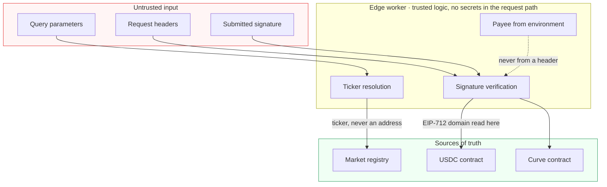
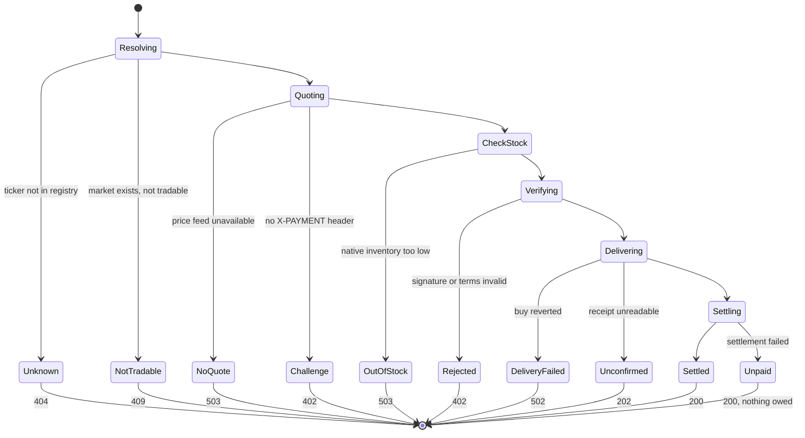
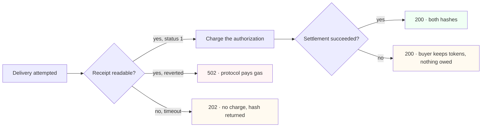
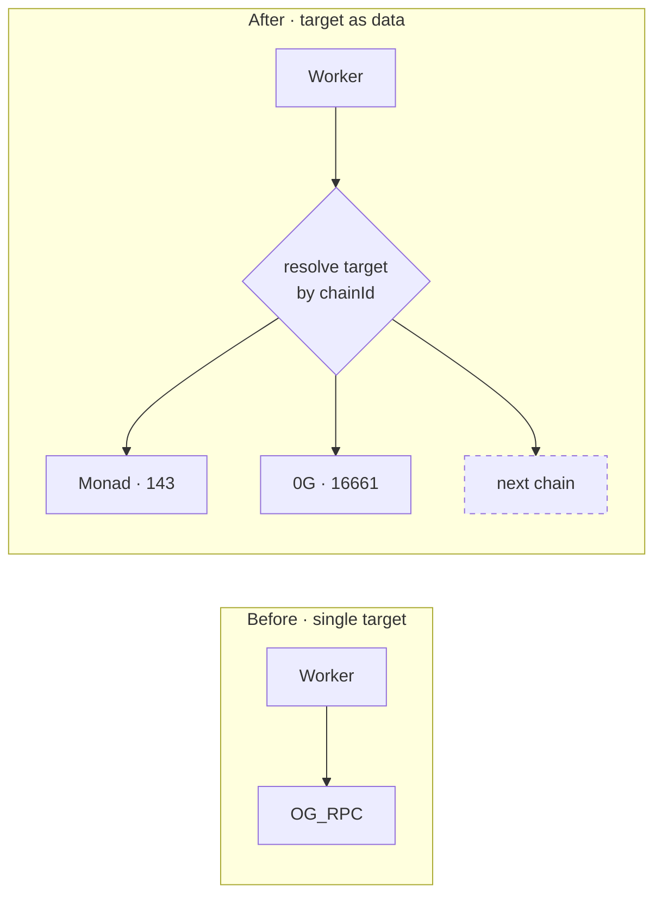

# Architecture

Deeper detail than the README. This document explains **why** each boundary sits where it
does, because most of these choices were made by discovering the failure first.

- [Trust boundaries](#trust-boundaries)
- [State machine of a request](#state-machine-of-a-request)
- [Where a caller could attack, and what stops them](#where-a-caller-could-attack-and-what-stops-them)
- [Failure modes and who absorbs them](#failure-modes-and-who-absorbs-them)
- [Pricing and why the first price was wrong](#pricing-and-why-the-first-price-was-wrong)
- [Making delivery multi-chain](#making-delivery-multi-chain)
- [Key custody](#key-custody)

---

## Trust boundaries

The rule the diagram encodes: **nothing that decides where money goes may originate in the
request.** The payee comes from worker configuration. The curve comes from the registry.
The signing domain comes from the token contract. A caller controls only what they are
paying for and, optionally, which address receives the tokens.

That last exception is deliberate and bounded. If `?to=` is absent the recipient defaults
to the address that **signed** the payment, which is the only party provably in control of
the funds.

---

## State machine of a request

Two transitions carry most of the design weight.

**`CheckStock` runs before `Verifying`.** Filling an order means spending native balance
the protocol holds, so capacity is finite. Checking it before touching anyone's money
means a caller who cannot be served gets `503` with their authorization still unspent,
rather than paying for something undeliverable.

**`Unpaid` still returns `200`.** If delivery succeeded but settlement failed, the tokens
are already in the buyer's wallet. The response says so and states that nothing is owed.
Reporting an error there would be false — the buyer got what they asked for — and
retrying would deliver twice.

---

## Where a caller could attack, and what stops them

| Attack | What it would achieve | What stops it |
| --- | --- | --- |
| Supply a curve address directly | Spend protocol funds on a contract of the attacker's choosing | Requests name a ticker; the address is resolved through the registry |
| Supply the payee in a header | Redirect the USDC | Payee is read from worker environment. The header that once did this was removed |
| Forge a transfer authorization | Receive tokens without paying | Signature is recovered and matched to `from`; USDC re-checks it during settlement |
| Replay a spent authorization | Pay once, buy repeatedly | EIP-3009 records the nonce on-chain; `authorizationState` is checked before both verify and settle |
| Sign a smaller amount than quoted | Underpay | Signed `value` is compared against `maxAmountRequired` |
| Sign for a different recipient | Divert payment | Signed `to` is compared against the configured payee |
| Craft a favourable EIP-712 domain | Make an invalid signature verify | Domain is read from the token contract, not from `extra` |
| Race the quote | Get a better fill than quoted | `minTokensOut` is derived from the quote and enforced on-chain by the curve |
| Drain inventory cheaply | Exhaust native balance below cost | Spread and slippage in bps, plus a capacity check with gas headroom reserved |

The one thing deliberately **not** defended against is a leaked relayer key.
`transferWithAuthorization` is permissionless and its entire content is signed by the
payer, including `to` and `value`, so the relayer key carries no authority to move anyone's
funds or change a destination. The worst outcome of a leak is drained gas.

---

## Failure modes and who absorbs them

Every non-green outcome above is absorbed by the protocol, not the buyer. That is the
direct consequence of ordering delivery before the charge, and it is the reason the
ordering is not treated as an implementation detail.

The `202` branch exists because of a real incident rather than caution. A 0G RPC node
answered `-32000 no matching receipts found` for a transaction that had already been
mined; `tx.wait()` reported that as a coalescing error; the worker concluded the delivery
had failed and charged nothing. The buyer received tokens for free and the inventory was
gone. Receipts are now polled with retries, and an unreadable receipt is reported as
unconfirmed with its hash — never as a failure, and never as grounds to charge.

---

## Pricing and why the first price was wrong

The first live price was `0.02 USDC` per fill. Measured against the actual transactions:

| Component | Value |
| --- | --- |
| Revenue at 0.02 USDC, 3% spread | ~$0.0006 |
| Base settlement gas | $0.00128 |
| Delivery gas on the target chain | $0.00008 |
| **Net margin on the first real fill** | **−$0.00075** |

Break-even sat near `$0.05`, so the price moved to `0.10 USDC`, where a 3% spread yields
roughly `+$0.0016` per fill. This is recorded because the mistake is instructive: the
spread was sized against the trade value while the dominant cost was **settlement gas on
the payment chain**, which is independent of trade size.

It also sets an expectation for Monad. Launch gas measured `~0.322 MON` at 102 gwei versus
`~0.0127 0G` at 4 gwei for identical factory bytecode, so per-fill delivery cost must be
re-measured on Monad rather than assumed to match 0G.

---

## Making delivery multi-chain

The parent worker's configuration carries exactly one delivery endpoint, `OG_RPC`. That
makes 0G not a choice but the only expressible destination.

Copying `OG_RPC` into `MONAD_RPC` would work for two chains and break on the third. What
rots in that approach is not the code but the assumption that the number of destinations is
known when the config file is written. `src/chains.ts` makes destinations data, so adding a
chain is one entry.

Each target must carry its own RPC, native symbol, factory address with a verified
`VERSION`, agent registry, treasury, and a working explorer. The probe drift-checks the
last three against the chain on every run, so a stale entry is caught before it reaches a
payment path.

---

## Key custody

| Key | Holds | Blast radius if leaked |
| --- | --- | --- |
| Relayer / operator | Base gas, plus native inventory on delivery chains | Gas and inventory only. Cannot move a payer's funds or redirect a payment |
| Deployer | Factory deployments | Never placed in the edge environment |

The operator is a dedicated address, not the deployer. That separation is the reason a
compromise of the edge cannot reach contract deployment authority, and it is why the
relayer key can sit in a worker environment at all.

---

## Related

- [`README.md`](../README.md) — overview, status matrix, verified chain reads
- [`0xcuy/adexto`](https://github.com/0xcuy/adexto) — curve, factory, registry, web app
- [`adexto.xyz/x402`](https://adexto.xyz/x402) — the integration reference for the live endpoint
