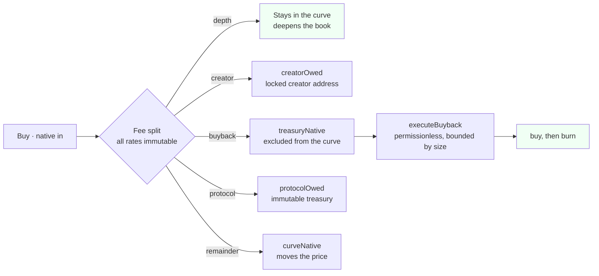
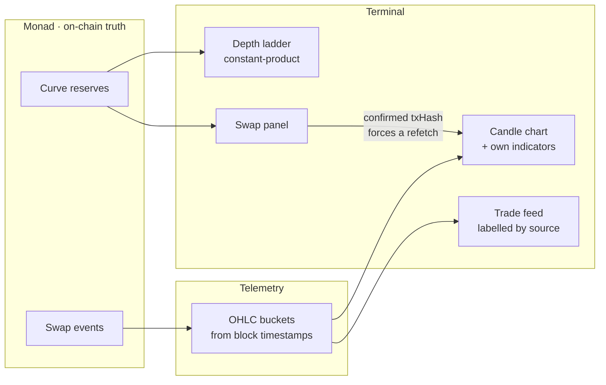

# Market structure and the trading terminal

> [!NOTE]
> Moved out of the README on 2 October 2026. It was written in September, when ADEXTO ran on four mainnets with
> factory `0.11.0`. The curve and the terminal are the same on ADEXTO v1, now on five; where v1 differs (the
> protocol leg inside the total, the 180-second launch window, the one-hour buyback cooldown) the README says so.

## The market structure

The curve is a constant-product AMM whose native side opens at a number in storage rather
than a balance in the contract:

```
nativeReserve = virtualNative + curveNative        curveNative starts at 0
k             = nativeReserve * tokenReserve
```

Because 100% of supply enters the curve at genesis, `virtualNative` **is** the opening
market cap — not an approximation of it. Solvency is proven by construction rather than by
policy: `k / (tokenReserve - sold) >= virtualNative` holds for every reachable state, so
the curve can always pay out what it owes.

Four fee legs, and every rate is `immutable` with no setter and no admin:



What each leg buys you, and why the split is inside the total rather than added on top:

| Leg | Accrues to | Who can move it |
| --- | --- | --- |
| depth | the curve itself | nobody — it is reserve |
| creator | `creatorOwed` | the creator address locked at launch |
| buyback | `treasuryNative`, excluded from reserve | **anyone**, via `executeBuyback` |
| protocol | `protocolOwed` | claimable only to an `immutable protocolTreasury` |

Three properties follow, and they are the reason this is a market primitive rather than a
launch button:

**Native leaves only two ways.** A seller's payout, or a fee claim. There is no
`withdraw`, no `sweep`, no `rescue`, and no owner to call one. That is what makes the curve
a venue instead of a custody arrangement.

**Buyback is permissionless.** `executeBuyback` is bounded by size, not by identity, so the
burn path does not depend on the team being alive or willing.

**Nothing about the economics can be changed after launch.** Rates are `immutable` at
construction. A governor contract is deployed on all four chains and controls exactly
nothing, because there is no setter for it to call.

---

## The trading surface

A market that is four minutes old cannot be charted by an embed. A TradingView or
GeckoTerminal frame resolves a symbol against that provider's database, and a token
launched from this factory minutes ago is in neither — so the embed renders empty. The
terminal therefore computes its own indicators from the same candles it draws.



**Sub-minute candles, because a newborn curve trades per second.** Timeframes run
`1s · 5s · 15s · 1m · 5m · 15m · 1h · 4h · 1d · 1y`. On a one-minute bucket, a buy then a
sell then a buy inside the same minute collapse into a single candle whose close is
whichever happened last — which describes the minute but hides the market.

**Indicators are computed, not embedded.** `lightweight-charts` is TradingView's renderer
but ships no indicators, so overlays and panes are derived locally: EMA 9, EMA 21, SMA 50,
Bollinger 20,2 and VWAP as overlays; RSI 14 and MACD 12,26,9 as panes.

**An under-warmed indicator is not drawn.** RSI(14) needs 15 bars and MACD needs 34. Below
that the series is a gap and the footer states how many bars are still missing. A
half-warmed average rendered as a confident line is the same class of lie as an invented
candle, and this is where most young-market charts quietly break.

**Depth is the real clearing price.** The ladder is computed with the same constant-product
formula the contract executes, so a level's price is what a trade of that size would
actually clear at — not `spot × (1 ± i × 0.002)` with a flat size per level, which is what
it used to be. When no executable pool exists it says so instead of inventing depth.

**Fills are labelled by source.** Genesis seeding is never presented as live market
activity, and `AUTO_BUYBACK` is distinguished from a trader's `BUY`. Each row links to the
explorer for its own `chainId` rather than guessing from a chain-name substring.

**A confirmed trade updates the chart immediately.** Polling runs every 15 seconds; without
an override, someone who just sold would watch a chart with no sign of their fill. The
refetch is keyed on the transaction hash and fires after the receipt is parsed, so the swap
log is already in a block when the data is re-read.

**Market cap has no footnote.** With 100% of supply in the curve, no locked portion and no
creator allocation, MCAP and FDV are the same number.

---

## Why Monad, specifically

This product is unusually sensitive to settlement, which is what makes the chain choice
substantive rather than a deployment target.

**Sub-second finality is what makes a 1-second candle mean anything.** The chart's shortest
buckets are only useful if trades actually confirm inside them. On a chain with multi-second
finality, a `1s` timeframe is a row of gaps pretending to be a market.

**The terminal reads block timestamps, not the wall clock.** Trade times come from the block
a fill landed in, so a chain whose blocks are dense produces candles that reflect sequence
rather than approximation.

**Cheap gas is what makes a deposit-free launch honest.** Removing the liquidity deposit
only helps if what remains is genuinely small. Launch cost was measured, not assumed:

| Chain | Launch gas | Cost | Gas price |
| --- | --- | --- | --- |
| Monad | 3,159,443 | ~0.322 MON | 102 gwei |
| 0G | 3,168,379 | ~0.0127 0G | 4 gwei |

Identical factory bytecode on both, so that difference is chain economics rather than a
code difference. It is recorded because per-fill delivery cost on Monad has to be
**re-measured** rather than assumed to match 0G — the same mistake that made the first
cross-chain price unprofitable, described [below](X402.md#the-value-loop).

---

[Back to the README](../README.md)
