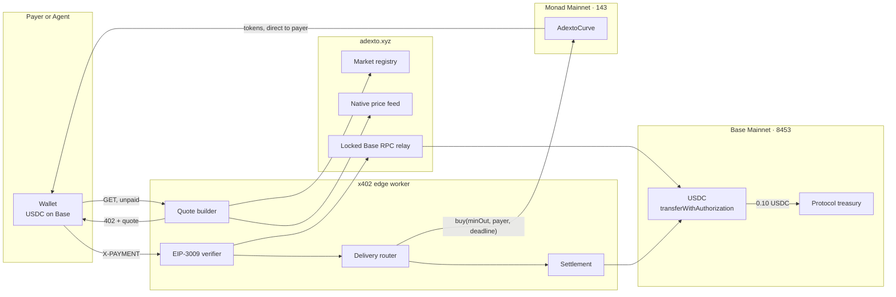
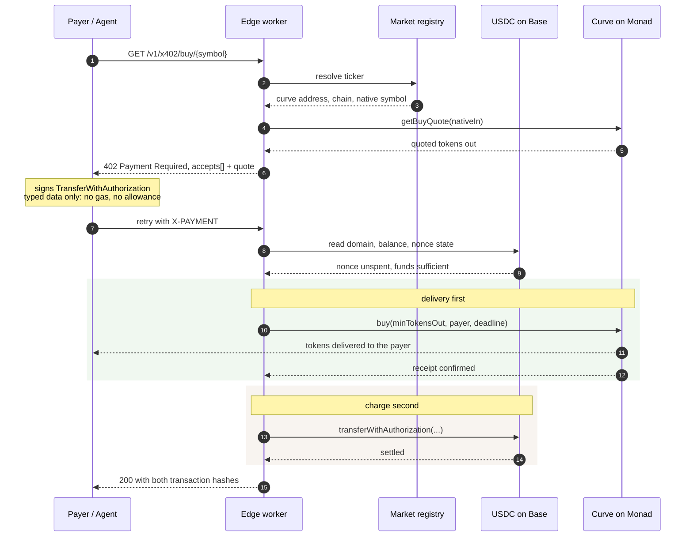
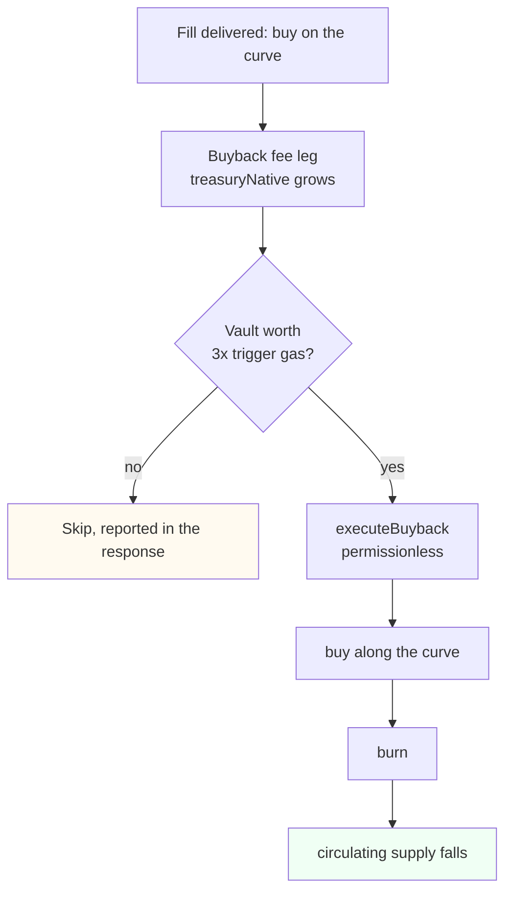

# Buying a Monad market from another chain

> [!NOTE]
> Moved out of the README on 2 October 2026 with its figures unchanged. The gateway, its delivery-first ordering and
> the pricing below are what runs today; the transaction tables are dated records. The newest Monad delivery,
> SAi Monad's first fill on 1 October 2026, is in the README.

## Reaching a Monad market from another chain

A market can only live on one chain. A buyer's money does not have to.

Without this, buying into a Monad market while holding USDC elsewhere means bridging,
waiting, acquiring MON for gas, and then trading. Three steps and a gas asset the buyer
never wanted. For an autonomous agent it is usually a hard stop, because each step needs a
different integration and at least one typically needs a human.

The on-ramp collapses that into one paid HTTP request. The buyer signs a single EIP-3009
transfer authorization for USDC on Base — typed data, not a transaction, so no gas and no
allowance — and the curve on Monad delivers the tokens to their own address.





Three properties of that path are load-bearing, and each closes a specific abuse:

**The market is never chosen by the caller.** A request names a ticker; the curve address
behind it is resolved through the registry. An earlier draft accepted the payee from a
request header, which would have let the caller redirect the money outright.

**The signing domain is read from the token, not the request.** Taking the EIP-712 domain
from caller-supplied fields would let a payer choose values that make an invalid signature
verify.

**Base is reached through a locked relay, not a public RPC.** Measured from inside a
Cloudflare Worker, every public Base endpoint rate-limited the shared egress: `drpc` 429,
`publicnode` `-32005`, `1rpc` `-32001`, `mainnet.base.org` `-32016`, `llamarpc` 525. The
relay allowlists a small method set, refuses batches, and requires a shared key.

---

## Why delivery runs before the charge

The two legs land on different chains and nothing on-chain binds them, so one has to go
first. That ordering decides who absorbs a failure.

| Order | If the second leg fails | Who pays |
| --- | --- | --- |
| Charge, then deliver | Protocol holds the buyer's USDC and owes them tokens | **the buyer** |
| Deliver, then charge | Protocol spent its own native balance and collected nothing | **the protocol** |

The second is the only acceptable direction, and it matches what the x402 specification
recommends: verify, serve, settle.

Stated plainly rather than dressed up: **the two legs are not atomic.** The buyer carries
no funds risk, because no charge is taken until a delivery has already succeeded. What they
do rely on is the operator submitting that buy. That dependency is real and is not hidden
behind the word "trustless".

One consequence is handled explicitly in code. A 0G RPC node was observed answering
`-32000 no matching receipts found` for a transaction that had already been mined, which
`tx.wait()` surfaces as a coalescing error. That exact behaviour once recorded a successful
delivery as a failure, so a buyer received tokens and was never charged. Receipts are now
polled with retries, and an unreadable receipt returns `202` with the hash and no charge —
never a claim of failure, and never a charge without confirmation.

---

## The value loop



There is nothing to route. `treasuryNative` can only be filled by the curve's own
buyback fee leg — no external transfer can add to it — and an x402 delivery is itself a
`buy`, so it pays that leg and the vault grows on every fill.

What was actually missing was smaller than it looked: **nobody had ever called
`executeBuyback`.** Read from chain before this shipped, `totalTokensBurned` was `0` on
both live markets while the vault had been accruing for 20 swaps.

The threshold is the part worth explaining. One `executeBuyback` call costs roughly
`0.0005 0G` in gas, and the vault accrues `0.000257 0G` per fill — so burning on every
fill would spend about twice the value it destroyed. Autonomous does not mean *every
time*; it means *no human decides*. The edge compares the vault against the live gas
price and burns once it is worth at least 3x the trigger cost, so no burn ever costs
more than it destroys, and every response reports the decision with its numbers.

**Supply has already fallen.** The first buyback spent the vault in full and destroyed
`7.110759702852663544 $ADEXTO`, moving total supply from `999,999,925.841335527761992555`
to `999,999,918.730575824909329011`. Confirmed by reading `totalTokensBurned` on the
curve and `totalSupply` on the token before and after, not from the receipt alone:
[`0x792023ab…8ab66bc5`](https://chainscan.0g.ai/tx/0x792023abdcf0ce1af431cb717a874e0344d1e3f8b84223aeddeaff008ab66bc5).

Pricing that loop was got wrong once, and it is worth recording because the error is
instructive. The first live price was `0.02 USDC` per fill:

| Component | Value |
| --- | --- |
| Revenue at 0.02 USDC, 3% spread | ~$0.0006 |
| Base settlement gas | $0.00128 |
| Delivery gas on the target chain | $0.00008 |
| **Net margin on the first real fill** | **−$0.00075** |

The spread had been sized against trade value while the dominant cost was **settlement gas
on the payment chain**, which is independent of trade size. Break-even sat near `$0.05`, so
the price moved to `0.10 USDC`, where a 3% spread yields roughly `+$0.0016` per fill.


---

## Delivery history

### 0G Mainnet · 16661 — the proven benchmark

```
AdextoFactory        0x51c4168226463F7e5A141e1c6D30520734BC840a
  VERSION            0.11.0        (identical bytecode length to Monad)
  totalProjectsCount 3             $ADEXTO, $ADT, $ZEEBO

deployTrinity        simulated clean, 3,168,379 gas, ~0.0127 0G at 4 gwei
```

0G stays in the registry on purpose. It was the first fill target whose payment path was
proven with real funds, and it is still where the burn path is proven, so it is the number
every Monad claim gets measured against instead of being measured against a hope.

**One thing Monad now has that 0G does not: a live market with an ERC-8004 binding.** The
first `$ADEXTO` market on 0G was bound to `agentId 3545431`, and relaunching it onto the
`0.11.0` factory to gain the protocol fee leg sent `bindAgent: false` — hard-coded in the
relaunch script. `agentBound` is `immutable`, so the live `$ADEXTO` at
[`0xA1358C17…1DF7`](https://chainscan.0g.ai/address/0xA1358C17004469C7CA5365AbafD294F9b2c11DF7)
reads `agentBound false` permanently. `$PARCEL` and `$CURB` here read `agentBound true,
agentId 10251` and were never relaunched, so Monad is where that property is still
observable on a listed market. The script is fixed and now refuses to launch unbound when
the market it replaces was bound, but the fix cannot reach a market that already exists.

**All four mainnets are now fill targets, and that changes what Monad is being compared to.**
`DELIVERY_RPC` in the worker maps a market's `chainId` to its own endpoint, so Base and
Arbitrum became targets by getting a market rather than by getting new code. Read back from
chain, all `status 1`, all submitted by the relayer `0xDe1f5e5505c01aC6C847146fF76E0e067A49C627`:
`$WOMBO` delivered on Arbitrum at block `505674141`, `$BLOOP` at Base block `51375604`, and
`$ZEEBO` on 0G at block `44560323` with its settlement on Base at `51419336`. Monad is no
longer the only chain proving the router — it is the chain where the router was first proven
against something other than 0G.

### The cross-chain buys that actually happened

Each row is one HTTP request that moved money on two chains. Every figure below was read from
the transaction logs, not from the gateway's response — a 200 says the call did not throw,
which is not the same as a token arriving.

**Delivered on Monad.** The payer held USDC on Base, no MON, and signed nothing but an
authorization.

| # | Paid on Base | Delivered on Monad | Received | Round trip |
| --- | --- | --- | --- | --- |
| 1 | [`0xf95c7c66…7290f190`](https://basescan.org/tx/0xf95c7c66fab2fbc5b56b902fccba583d5f3def1538a8891883766b4e7290f190) | [`0x4df10f36…bd67088e`](https://monadscan.com/tx/0x4df10f36232107e52dbb925f9c056435ec4806d8068e00a84d732ba1bd67088e) | `24,091.244065390845787333 $PARCEL` | 11.8s |
| 2 | [`0xfb744ca0…1b78f5da`](https://basescan.org/tx/0xfb744ca03aa5e755c297e7f1c088407dd55786023334f53d6cad10fb1b78f5da) | [`0x2b9540f8…aaf21e08`](https://monadscan.com/tx/0x2b9540f8bc2f34030d23d83b4ae7d96e5d687c8780a12d1cb2643677aaf21e08) | `24,034.289690016296025975 $PARCEL` | 10.8s |

Read from the logs of those four transactions: both deliveries `status 1`, `99,888` gas each,
and in each one the `Transfer` moves `$PARCEL` **from the curve straight to the payer** — there
is no hop through an address we control, which is what "no custody" means here rather than a
promise. On Base, `0.100000 USDC` leaves the payer and arrives at the treasury, exactly the
quoted price, in `85,780` gas.

**The delivery block is 6 and 7 seconds EARLIER than its settlement block.** That is not a
timing artefact, it is [the ordering](#why-delivery-runs-before-the-charge) made visible: the
tokens are sent before the charge is taken, so a delivery that fails costs us and never the
buyer. The two block timestamps are the cheapest way to check that claim.

**Delivered on 0G**, the leg that was proven first and is kept because it proves something
different — that the payment path worked before delivery could reach more than one chain.

| Leg | Chain | Transaction |
| --- | --- | --- |
| Payment | Base | [`0x65a79f7b…8a62190`](https://basescan.org/tx/0x65a79f7b35fb755aee92da2bb11703df1045955188df352ab4dcfc9b18a62190) |
| Delivery | 0G | [`0x7a1583a3…02e6d7daf`](https://chainscan.0g.ai/tx/0x7a1583a34e7abd49347b2686bf7c63cf0344f39ec565d85df73ffb502e6d7daf) |
| Settlement-only test | Base | [`0x470494bd…6d75049d2`](https://basescan.org/tx/0x470494bd9b1401cd7e9a9ede88dc54011d96ea8d2e06624445d7b216d75049d2) |

Replaying a spent authorization is refused with `invalid_transaction_state`, and no second
transfer is broadcast.

**Reproducible, which it was not before.** These are produced by
[`scripts/x402-buy.mts`](https://github.com/0xcuy/adexto/blob/main/scripts/x402-buy.mts) in the
parent repo: it reads the 402 challenge, signs the authorization, resends with `X-PAYMENT`, then
verifies by reading both chains. Until it existed, the first two purchases were cited as
evidence while nothing in either repo could re-derive them — the strongest claim resting on two
hashes nobody could reproduce, including us. The signing deliberately uses a public Base RPC
rather than our own relay, because a buyer should need none of our infrastructure.

**What the payer never needed:** MON, a bridge, an account, an API key, or a transaction of
their own.

---

[Back to the README](../README.md)
